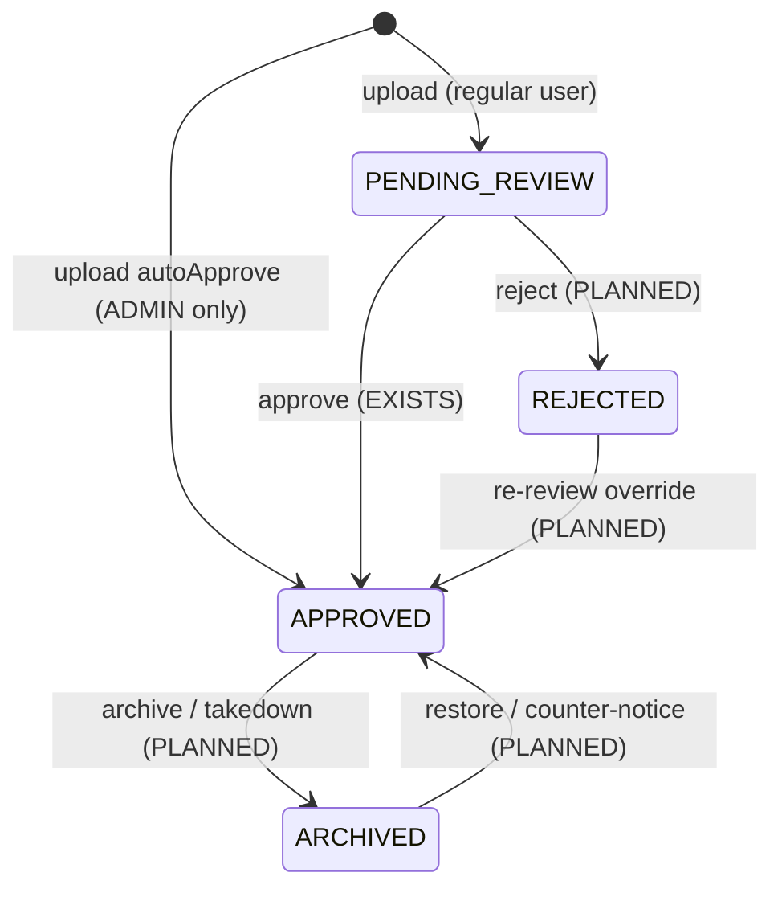

# Sound Library — Admin Dashboard Section 13

The platform's **reusable audio library** — the TikTok/Instagram/Facebook-style
system where a creator picks a sound and it becomes attachable to any reel,
post, or story, then discoverable ("all posts using this sound"), searchable,
and trending. This section is the admin's home for **curating that catalog**:
the approval queue, category curation, official/platform sounds, trending
oversight, uploader reputation, rights/copyright takedowns, and the library's
search-index health.

> Sounds began life as a subsection of [content-moderation.md](content-moderation.md)
> §2.6 (the approval queue). That queue is still documented there for the
> moderation-workflow view; **this document is the canonical, whole-subsystem
> reference** — catalog, curation, trending, rights, analytics, and ops.
> Where the two overlap (the approval flow), content-moderation defers here.

Tag legend and ground rules: [README.md](README.md). API surface consolidated
in [admin-api-blueprint.md](admin-api-blueprint.md) §3.3. Search-index mechanics
in [search-feed-trending.md](search-feed-trending.md); storage/CDN for the audio
files themselves in [media-storage.md](media-storage.md).

---

## 1. Purpose & scope

| In scope | Out of scope (see) |
|----------|--------------------|
| The whole sound-library catalog: browse, inspect, curate | Report state machine / strikes on the *uploader* → [safety-reports.md](safety-reports.md) |
| Approval queue (canonical spec; queue-workflow view mirrored in [content-moderation.md](content-moderation.md) §2.6) | Where the audio bytes are stored / CDN / transcode → [media-storage.md](media-storage.md) |
| Full state machine incl. the missing reject / archive / takedown transitions | Trending **algorithm** knobs shared with feed → [search-feed-trending.md](search-feed-trending.md) |
| Category curation (the 6 `SoundCategory` values) | Reel/post/story moderation that *uses* a sound → [content-moderation.md](content-moderation.md) |
| Official / platform ("PLATFORM_MUSIC") sound seeding | Per-user muted-word blocklist → [../settings/privacy.md](../settings/privacy.md) |
| Trending-sounds board + per-sound blast-radius | ES index registry & the reindex hooks → [search-feed-trending.md](search-feed-trending.md) |
| Uploader reputation (approval ratio, serial-reupload flags) | |
| **Rights / copyright / DMCA takedown** (Facebook Rights-Manager analog) | |
| `irc-sounds` index health + reindex control | |

**What "as Facebook / TikTok" means concretely here** — the parity targets this
section designs toward, each mapped to platform reality:

| Reference feature | On this platform | Status |
|---|---|---|
| TikTok "sound detail page" (all videos using this sound) | `GET /api/v1/sounds/{id}/posts` → `posts_by_sound` | **[EXISTS]** |
| TikTok Commercial Music Library / IG "Sounds" curated catalog | `sounds_by_category` browse, `SoundCategory` = NASHEED / QURAN_RECITATION / LECTURE_CLIP / NATURE / ORIGINAL / PLATFORM_MUSIC | **[EXISTS]** |
| Instagram sound picker (typo-tolerant search, popularity-ranked) | `GET /api/v1/sounds/search` → `irc-sounds` (fuzzy title/artist × log1p useCount) | **[EXISTS]** |
| "Original audio" attribution | `SoundCategory.ORIGINAL` + `uploaderId` on the row | **[EXISTS]** (category only; no per-post "original from @user" surfacing) |
| TikTok trending-sounds chart | `sound_counters.use_count` + `posts_by_sound` | **[PARTIAL]** — raw totals only, no time-decayed trend |
| Facebook Rights Manager / TikTok muted-audio takedown | copyright takedown → `ARCHIVED` + strip from adopting posts | **[PLANNED]** |
| Music-label / official-partner uploads | `autoApprove` + `PLATFORM_MUSIC` | **[PARTIAL]** — the mechanism exists; no seeding/import tool |
| Sound-swap / detach on a live post | — | **[PLANNED]** |

---

## 2. Ground truth — what exists today (verified against source)

Every claim below was read from current code (`app/post/cassandra/**`,
`app/post/search/**`, `app/post/enums/**`, `SearchAdminController`).

### 2.1 Storage — Cassandra (4 tables) + Elasticsearch (1 index)

| Store | Table / index | Role | Class |
|---|---|---|---|
| Cassandra | `sounds_by_id` | Canonical row, point-read by id | `SoundEntity` |
| Cassandra | `sounds_by_category` | Browse newest-first per category — **APPROVED only** | `SoundByCategoryEntity` |
| Cassandra | `posts_by_sound` | "All posts using sound X" (TikTok discover feed) | `PostBySoundEntity` |
| Cassandra | `sound_counters` | `use_count` counter, +1 per adopting post | `SoundCounterEntity` |
| Elasticsearch | `irc-sounds` | Search / popularity ranking (`createIndex=false`) | `SoundSearchDocument` |

`SoundEntity` (`sounds_by_id`) columns: `id`, `title`, `artist_name`,
`audio_url`, `cover_art_url`, `duration_seconds`, `category` (String),
`status` (String), `uploader_id`, `created_at`, `updated_at`. **The audio
itself is a URL** — this table stores no bytes; the file lives wherever
`audioUrl`/`coverArtUrl` point ([media-storage.md](media-storage.md)).

### 2.2 The write fan-out (what happens on each event)

```
upload (autoApprove=false)         upload (autoApprove=true) / approve
────────────────────────────       ─────────────────────────────────────
sounds_by_id      ← PENDING        sounds_by_id       ← APPROVED
irc-sounds        ← indexAsync     sounds_by_category ← writeCategoryRow
                                   irc-sounds         ← indexAsync / refreshAsync

post adopts a sound (CassandraSoundService.recordPostUsage)
──────────────────────────────────────────────────────────
posts_by_sound    ← new row (soundId, createdAt, postId, authorId)
sound_counters    ← incrementSoundUse (use_count++)
irc-sounds        ← refreshAsync  (reload use_count → keep ranking fresh)
```

The search index is **eventually consistent** and best-effort: every ES write
goes through `EsRetry` inside an `@Async` method and only logs on failure —
Cassandra is always the source of truth. A drifted `use_count` in `irc-sounds`
is repaired by the reindex (§2.5), not by a transaction.

### 2.3 API surface today (`CassandraSoundController` @ `/api/v1/sounds`)

| Method | Path | Auth | Notes |
|---|---|---|---|
| POST | `/api/v1/sounds` | `isAuthenticated()` | Upload. Uploader **always** the JWT caller (body `uploaderId` ignored). `autoApprove=true` honored **only** if caller role ∈ `MODERATION_ROLES = Set.of(Role.ADMIN)` — everyone else is forced `PENDING_REVIEW`. |
| GET | `/api/v1/sounds/{id}` | public | Canonical row or 404. |
| GET | `/api/v1/sounds/search` | public | `q` (required; blank→`[]`), `category?`, `limit` clamped **1..100** (default 20). APPROVED-only, fuzzy, popularity-boosted. |
| POST | `/api/v1/sounds/{id}/approve` | `hasAnyRole('ADMIN','MODERATOR','SUPER_ADMIN')` | **The only moderation transition that exists.** Idempotent. See the two caveats below. |
| GET | `/api/v1/sounds/by-category/{category}` | public | `pageSize` (default 20), `cursor?` (Instant). Cursor-paginated browse. |
| GET | `/api/v1/sounds/{id}/posts` | public | `pageSize` (default 20). All posts using the sound. |
| GET | `/api/v1/sounds/{id}/usage` | public | `{soundId, useCount}`. |

**Two caveats on the approve endpoint — carry these into the dashboard:**

1. **Phantom roles.** `hasAnyRole('ADMIN','MODERATOR','SUPER_ADMIN')` references
   `MODERATOR` and `SUPER_ADMIN`, which **do not exist** in `Role`
   (`USER / RESEARCHER / SCHOLAR / ADMIN`). The grant is effectively **ADMIN-only**;
   the extra names are dead SpEL. (Consistent with the platform's four-role
   model — [users-roles.md](users-roles.md).)
2. **Outside the admin prefix.** It lives under `/api/v1/sounds`, **not**
   `/api/v1/admin/**`, so it misses the filter-chain double gate that every
   other admin mutation gets ([architecture.md](architecture.md)). It relies on
   the `@PreAuthorize` annotation alone. → Blueprint recommends an
   `/api/v1/admin/sounds/{id}/approve` alias.

### 2.4 Admin surface today

| Capability | Status |
|---|---|
| `POST /api/v1/admin/search/sounds/reindex?drop=` | **[EXISTS]** `SearchAdminController.reindexSounds`, `hasRole('ADMIN')`, synchronous, returns `ReindexSummary` |
| Approve a pending sound | **[EXISTS]** (the stray endpoint above) |
| Auto-approve on upload | **[EXISTS]** (ADMIN-only, via `autoApprove`) |
| **List pending sounds** | **MISSING** — see §2.6 |
| Reject / archive / takedown / delete | **MISSING** — see §5 |
| Uploader history / reputation | **MISSING** |
| Trending board | **MISSING** (data exists, no surface) |
| Rights / copyright register | **MISSING** |

### 2.5 Search: `SoundSearchService` (`irc-sounds`)

- **`searchIds(q, category, limit)`** — `bool`: `must` multi_match
  `title^3 / artistName^2` (BestFields, fuzziness AUTO, tieBreaker 0.3) +
  `should` phrase-prefix boost 1.5 + `filter status=APPROVED` (+ optional
  `category` term); wrapped in a `function_score` = relevance **×**
  `log1p(useCount)`. Caller hydrates ids from `sounds_by_id`, preserving order,
  dropping any that no longer resolve or aren't APPROVED.
- **`indexAsync` / `refreshAsync` / `deleteAsync`** — async single-doc writes;
  `refreshAsync` reloads the row **and** `sound_counters.use_count`, and
  **de-indexes** a sound that's gone missing.
- **`reindexAll(dropFirst)`** — full table walk, 100-row batches, one bulk
  counter IN-query per batch (not a per-row point read). `dropFirst=true`
  drops + `createWithMapping()` so `Keyword` fields (`category`, `status`)
  don't get dynamically remapped to `text`. Returns `ReindexSummary`
  `{dropped, indexed, batches, ms, note}`. The library is a **bounded curated
  catalog**, so a full scan is deliberately acceptable here (unlike posts).

### 2.6 The blocking gap: no status/uploader index

`sounds_by_id` is keyed by `id` only. **There is no way to list "all
PENDING_REVIEW sounds" or "all sounds by uploader X" from Cassandra today** —
the partition key doesn't support it, and the service javadoc says the review
query is "out of scope here". This single gap blocks the approval queue, the
uploader-reputation panel, and any status dashboard. Two ways to close it
(pick one, documented in §11):

- **A — new Cassandra tables** `sounds_by_status (status, created_at DESC, sound_id)`
  and `sounds_by_uploader (uploader_id, created_at DESC, sound_id)`, written on
  every status transition. Fast, precise, but adds two more rows to the fan-out.
- **B — query `irc-sounds`** with a `status` term (it's a `Keyword` field
  already) + `uploaderId` (would need adding to the document). No new Cassandra
  tables; couples the admin queue to ES availability, and ES is eventually
  consistent, so a just-uploaded sound may lag the queue by a moment.

Recommendation: **B for the pending queue** (ES already holds `status`; add
`uploaderId` to `SoundSearchDocument`), because the queue tolerates slight lag
and it's zero new write-path cost. Use **A only if** the queue must be strongly
consistent with the moment of upload.

### 2.7 Events

`rabbitmq/event/post/SoundApprovedEvent` (`soundId, uploaderId, soundTitle,
occurredAt`) is **defined but DEAD** — grep finds it referenced nowhere but its
own file. It is neither published on approve nor consumed. Wiring it (publish in
`CassandraSoundService.approve` → an uploader notification) is a phase-2 rider
(§11). A `SoundRejectedEvent` / `SoundArchivedEvent` pair is **[PLANNED]** for
the same path.

---

## 3. Dashboard views / widgets

### 3.1 Library overview (landing) [PLANNED]

The at-a-glance state of the catalog. Stat tiles + two panels.

| Widget | Shows | Source |
|---|---|---|
| Catalog size tiles | Total sounds · APPROVED · PENDING · REJECTED · ARCHIVED | status counts (§2.6 index) **[PLANNED]** |
| Pending depth + oldest age | Live `PENDING_REVIEW` count and max wait; red past SLA | §2.6 index **[PLANNED]** |
| Category mix | Sounds per `SoundCategory` (donut) | per-category counts |
| Top sounds this week | Highest `use_count`, with Δ | `sound_counters` + trending collector (§8) **[PARTIAL]** |
| Recently approved | Last N approvals, approver, latency | decision log (§7) **[PLANNED]** |

### 3.2 Approval queue [PARTIAL → PLANNED]

The moderation-workflow spec is in [content-moderation.md](content-moderation.md)
§2.6; the canonical column/behavior spec lives here so the two never drift:

| Column / control | Behavior | Source |
|---|---|---|
| Pending list | `PENDING_REVIEW`, **oldest-first**; columns: cover, title, artist, category, duration, uploader, waited-for; badge > 48h | §2.6 index **[PLANNED]** |
| Inline preview player | Streams `audioUrl`, shows `coverArtUrl`; scrubber; optional waveform | `SoundEntity` fields **[EXISTS]** |
| Uploader mini-card | Handle, role, prior approval ratio, "N rejected before" flag | uploader index (§2.6-A/B) **[PLANNED]** |
| **Approve** | `POST …/approve`; on success publish `SoundApprovedEvent` → uploader notified | `approve` **[EXISTS]**; event publish **[PLANNED]** |
| **Reject + reason** | New endpoint; `{reasonCode, note}`; sets `REJECTED`, keeps `sounds_by_id` row (audit), removes ES doc, notifies uploader | **[PLANNED]** (§5) |
| Bulk approve/reject | Select N (≤100), one reason; per-item result list | reuses `/admin/moderation/bulk` **[PLANNED]** |
| Auto-checks | Duration in bounds, dedupe by audio hash, title profanity (reuse `KeywordNormalizer`) | **[PLANNED]** |

### 3.3 Sound inspector (detail drawer) [PARTIAL]

Opened from any list. Everything about one sound.

| Panel | Shows | Source |
|---|---|---|
| Header | Cover, title, artist, category chip, status pill, duration | `sounds_by_id` **[EXISTS]** |
| Player | `audioUrl` stream + waveform | **[EXISTS]** data |
| Provenance | Uploader (avatar-join — load via `findActiveWithProfileByIdIn`), created/updated, approver | `uploader_id` **[EXISTS]**; approver in decision log **[PLANNED]** |
| **Blast radius** | `use_count` + a live page of `posts_by_sound` ("in 3,214 reels; newest 4h ago") — the number that governs a takedown decision | `sound_counters` + `posts_by_sound` **[EXISTS]** |
| Adoption trend | Daily adoptions sparkline | needs `posts_by_sound` day-bucket rollup **[PLANNED]** |
| Rights | Copyright register match / claim state | **[PLANNED]** (§3.8) |
| Actions | Approve / reject / archive / takedown / re-category / edit metadata | mix of EXISTS + PLANNED (§5–6) |
| Audit strip | Every action on this sound, newest first | `audit_log_by_resource` **[EXISTS]** write / **[PLANNED]** read |

### 3.4 Category curation [PARTIAL]

The six categories are a **closed enum** (`SoundCategory`) — the admin curates
*within* them, not the list itself (adding a value is a code + enum-CHECK-drop
change — though sounds are Cassandra, so no enum-CHECK-constraint applies here,
only an app-enum edit).

| Widget | Behavior | Source |
|---|---|---|
| Category board | Per category: count, top sound, weekly adoptions | `sounds_by_category` + counters **[EXISTS]/[PARTIAL]** |
| Re-categorize | Move a sound to another category → rewrite its `sounds_by_category` row (delete old partition row, insert new), reindex | **[PLANNED]** endpoint |
| Featured shelf | Curated "picks" per category for the app's sound picker | new `sounds_featured` table **[PLANNED]** |
| Empty/thin categories | Flags categories with < N approved sounds (e.g. `NATURE`) so curators seed them | count query **[PLANNED]** |

### 3.5 Official / platform sounds (`PLATFORM_MUSIC`) [PARTIAL]

The label/partner analog: first-party audio that ships approved.

- **[EXISTS]** the mechanism — an ADMIN uploads with `autoApprove=true` and
  `category=PLATFORM_MUSIC`; the sound is APPROVED immediately and browsable.
- **[PLANNED]** a **seeding/import tool**: bulk-register a folder/manifest of
  official audio (title, artist, `audioUrl`, cover, duration) in one call, all
  auto-approved and attributed to a platform service account. Today each would
  be a separate `POST /api/v1/sounds`.
- **[PLANNED]** an **"official ✓" flag** distinct from category, so a
  first-party sound in `NASHEED` is still marked official. Add `official boolean`
  to `SoundEntity` + `SoundSearchDocument`.

### 3.6 Trending sounds [PARTIAL]

| Widget | Behavior | Source |
|---|---|---|
| Top-by-usage table | Highest `use_count`, all-time / rank | `sound_counters` **[EXISTS]** (no ordered index — needs a rollup, §8) |
| **Rising** | Time-decayed adoption velocity (last-24h adoptions ÷ baseline) | day-bucketed `posts_by_sound` rollup **[PLANNED]** |
| Manipulation guardrails | Flag a sound whose adoptions spike from few distinct authors (bot ring) | `posts_by_sound.authorId` distinct-count **[PLANNED]** — ties into [search-feed-trending.md](search-feed-trending.md) |
| Freeze / exclude from trending | Admin pins a sound out of the trending surface without archiving it | new `trending_excluded` flag **[PLANNED]** |

> The **algorithm** for trending (decay half-life, min-distinct-authors) is a
> feed-wide concern; this section owns the **sound-specific inputs and the
> exclude control**, and links to [search-feed-trending.md](search-feed-trending.md)
> for the shared machinery.

### 3.7 Uploader reputation [PLANNED]

Blocks abuse of the upload path (serial re-uploads of rejected audio, spam).

| Widget | Behavior | Source |
|---|---|---|
| Uploader panel | All sounds by a user, per-status counts, approval ratio | uploader index (§2.6) **[PLANNED]** |
| Serial-reupload flag | Same audio hash rejected → re-uploaded | audio-hash dedupe store **[PLANNED]** |
| Rate context | Uploads/day vs. platform norm | upload-event counter **[PLANNED]** |
| Escalation | Link to issue a strike ([safety-reports.md](safety-reports.md) — `StrikeService.issueStrike` exists, no controller) | **[PLANNED]** |

### 3.8 Rights & copyright (DMCA / Rights-Manager analog) [PLANNED]

The Facebook Rights Manager / TikTok muted-audio parity. **Entirely planned** —
no rights data exists today.

| Widget | Behavior | Source |
|---|---|---|
| Copyright register | Rights-holder reference fingerprints/claims | new `sound_rights` table **[PLANNED]** |
| Match review | New uploads matched against the register → hold instead of publish | fingerprint match job **[PLANNED]** |
| Takedown | Rights complaint → `ARCHIVED` + optionally **strip audio from adopting posts** (mute) using `posts_by_sound` as the work-list | **[PLANNED]** (§5 "takedown") |
| Counter-notice | Track uploader dispute → restore workflow | **[PLANNED]** |
| Blast-radius warning | Before takedown, show "N reels will be muted" from `use_count` | `sound_counters` **[EXISTS]** input |

Even without fingerprinting, a **manual takedown** (a human complaint →
archive + optional mute-adopting-posts) is a small, high-value phase-2 build
because the blast-radius data already exists.

### 3.9 Index health & reindex [EXISTS]

| Widget | Behavior | Source |
|---|---|---|
| `irc-sounds` health | Doc count vs. `sounds_by_id` APPROVED count; last reindex; mapping drift (`status`/`category` must be `keyword`) | ES `_count` + `ReindexSummary` **[EXISTS]** |
| Reindex button | `POST /api/v1/admin/search/sounds/reindex?drop=` — `drop=true` fixes a dynamically-remapped index | `SearchAdminController` **[EXISTS]** |
| Orphan sweep | ES docs whose `sounds_by_id` row is gone (`refreshAsync` self-heals one at a time; a sweep catches the rest) | reindex compares sets **[PARTIAL]** |

---

## 4. Data sources (per widget)

| Widget / flow | Store | Class / table / endpoint | Status |
|---|---|---|---|
| Canonical sound | Cassandra | `sounds_by_id` (`SoundEntity`) | **[EXISTS]** |
| Category browse | Cassandra | `sounds_by_category` (`SoundByCategoryEntity`, APPROVED-only) | **[EXISTS]** |
| Usage / blast radius | Cassandra | `sound_counters` (`use_count`), `posts_by_sound` (`PostBySoundEntity`) | **[EXISTS]** |
| Search / ranking | ES | `irc-sounds` (`SoundSearchDocument`), `SoundSearchService` | **[EXISTS]** |
| Reindex | ES | `SearchAdminController.reindexSounds` → `reindexAll` | **[EXISTS]** |
| Pending / status listing | ES or Cassandra | `irc-sounds` status term **or** `sounds_by_status` table | **[PLANNED]** (§2.6) |
| Uploader listing | ES or Cassandra | `uploaderId` term **or** `sounds_by_uploader` table | **[PLANNED]** |
| Decision log (approve/reject/archive/takedown) | PG | `moderation_decisions` (shared with [content-moderation.md](content-moderation.md)) | **[PLANNED]** |
| Per-resource audit | Cassandra | `audit_log_by_resource` (interceptor-written) | **[EXISTS]** write / **[PLANNED]** read |
| Adoption day-buckets (trend/rising) | Cassandra | `sound_adoptions_by_day` rollup | **[PLANNED]** |
| Rights register | PG | `sound_rights` | **[PLANNED]** |
| Featured shelf | Cassandra/PG | `sounds_featured` | **[PLANNED]** |
| Uploader notification | RabbitMQ | `SoundApprovedEvent` (dead) + planned reject/archive events | **[EXISTS but DEAD]** |

---

## 5. State machine

`SoundStatus { PENDING_REVIEW, APPROVED, REJECTED, ARCHIVED }` is fully defined
in the enum — but **only two states are reachable today**. `REJECTED` and
`ARCHIVED` are never written by any code path.



| Transition | Trigger | Effect | Status |
|---|---|---|---|
| → `PENDING_REVIEW` | regular user uploads | row in `sounds_by_id` only; ES indexed (non-APPROVED → never surfaces) | **[EXISTS]** |
| → `APPROVED` | ADMIN uploads with `autoApprove` | row + `sounds_by_category` + ES | **[EXISTS]** |
| `PENDING → APPROVED` | `approve` | writes `sounds_by_category`, ES refresh; **idempotent** | **[EXISTS]** |
| `PENDING → REJECTED` | reject `{reasonCode, note}` | keep `sounds_by_id` row (audit), **remove ES doc**, notify uploader, decision-log | **[PLANNED]** |
| `APPROVED → ARCHIVED` | archive / copyright takedown | delete `sounds_by_category` row + ES doc; **existing posts keep their audio** (`posts_by_sound` untouched) → archive stops *new* adoption only; takedown may additionally mute adopting posts | **[PLANNED]** |
| `REJECTED → APPROVED` | admin override on re-review | re-add category + ES | **[PLANNED]** |
| `ARCHIVED → APPROVED` | restore after counter-notice | re-add category + ES | **[PLANNED]** |
| hard delete | GDPR erasure of uploader's own content | purge all 5 stores + `posts_by_sound` detach | **[PLANNED]** — see [logs-audit.md](logs-audit.md) GDPR |

**Archive vs. takedown — the important distinction:** *archive* is a catalog
decision (retire a sound from new use, leave existing posts alone). *Takedown*
is a rights/safety decision that may also **strip the audio from posts already
using it** — walking `posts_by_sound` as the work-list and muting each. Both
land the sound in `ARCHIVED`; they differ in whether adopting posts are touched.
The dashboard must make the operator choose explicitly and show the blast radius.

---

## 6. Admin actions (endpoint table)

New routes under `/api/v1/admin/**` for the filter-chain double gate. Every
mutation writes an `audit_log_by_resource` row (interceptor) **and** a
`moderation_decisions` row; destructive ones require **step-up auth**
([architecture.md](architecture.md)). Full cross-doc table in
[admin-api-blueprint.md](admin-api-blueprint.md) §3.3.

| Action | Endpoint | Body / params | Danger | Step-up | Audit event | Status |
|---|---|---|---|---|---|---|
| List by status | `GET /api/v1/admin/sounds` | `status=PENDING_REVIEW`, `uploaderId?`, `category?`, `cursor,pageSize` | L | no | — (read) | **[PLANNED]** (needs §2.6 index) |
| Inspect | `GET /api/v1/admin/sounds/{id}` | — | L | no | — (read) | **[PLANNED]** — row + `use_count` + `posts_by_sound` page |
| Approve (re-homed) | `POST /api/v1/admin/sounds/{id}/approve` | — | L | no | `SOUND_APPROVED` | **[PLANNED]** alias over existing `approve`; deprecate stray `/api/v1/sounds/{id}/approve` |
| Reject | `POST /api/v1/admin/sounds/{id}/reject` | `{reasonCode, note}` | M | no | `SOUND_REJECTED` | **[PLANNED]** — sets `REJECTED`, ES doc removed, uploader notified |
| Archive | `POST /api/v1/admin/sounds/{id}/archive` | `{reason}` | M | no | `SOUND_ARCHIVED` | **[PLANNED]** — category row + ES removed; posts untouched |
| **Takedown** | `POST /api/v1/admin/sounds/{id}/takedown` | `{reason, muteAdoptingPosts:bool, rightsClaimId?}` | **H** | **yes** | `SOUND_TAKEDOWN` | **[PLANNED]** — archive + optionally mute `posts_by_sound` |
| Restore | `POST /api/v1/admin/sounds/{id}/restore` | `{reason}` | M | no | `SOUND_RESTORED` | **[PLANNED]** — from REJECTED/ARCHIVED |
| Re-categorize | `POST /api/v1/admin/sounds/{id}/category` | `{category}` | M | no | `SOUND_RECATEGORIZED` | **[PLANNED]** — rewrite `sounds_by_category` partition row |
| Edit metadata | `PATCH /api/v1/admin/sounds/{id}` | `{title?, artistName?, coverArtUrl?}` | M | no | `SOUND_EDITED` | **[PLANNED]** |
| Hard delete | `DELETE /api/v1/admin/sounds/{id}` | `{reason}` | **H** | **yes** | `SOUND_DELETED` | **[PLANNED]** — purge all stores; GDPR path |
| Bulk moderate | `POST /api/v1/admin/moderation/bulk` | `{action, targets[≤100], reason}` | **H** | **yes** | per-target + `MODERATION_BULK` | **[PLANNED]** — shared with content-moderation; actions incl. sound approve/reject/archive |
| Official bulk-seed | `POST /api/v1/admin/sounds/import` | `{items:[…]}` (≤100) | M | no | `SOUND_IMPORTED` | **[PLANNED]** — auto-approve, `PLATFORM_MUSIC`, platform service account |
| Uploader history | `GET /api/v1/admin/sounds/uploaders/{userId}` | `cursor` | L | no | — (read) | **[PLANNED]** |
| Exclude from trending | `POST /api/v1/admin/sounds/{id}/trending-exclude` | `{excluded:bool}` | M | no | `SOUND_TRENDING_EXCLUDED` | **[PLANNED]** |
| Reindex | `POST /api/v1/admin/search/sounds/reindex` | `drop` | H | no | (search-admin) | **[EXISTS]** `SearchAdminController` |

---

## 7. Logs & audit

Cross-reference the flagship [logs-audit.md](logs-audit.md); here's the
sound-specific slice.

| Log | Store | Written when | Status |
|---|---|---|---|
| `audit_log_by_resource` (resourceType=`SOUND`) | Cassandra | every admin mutation via interceptor | **[EXISTS]** write / **[PLANNED]** read surface |
| `moderation_decisions` (sound rows) | PG | approve / reject / archive / takedown / restore | **[PLANNED]** |
| App logs `[SOUND] …` | stdout | usage-record failure, search-unavailable warnings (`CassandraSoundService`, `SoundSearchService`) | **[EXISTS]** |
| App logs `[SEARCH] … sound …` | stdout | index/refresh/reindex outcomes | **[EXISTS]** |
| Reject/archive reason capture | PG | with the decision row (reasonCode + free note) | **[PLANNED]** |

Every decision must record **`use_count` at decision time** — a takedown's
blast radius is forensically meaningful ("this sound was in 3,200 reels when
removed") and `use_count` is monotonic, so it must be snapshotted, not read
later.

---

## 8. KPIs & chart specs

Follow the chart conventions used across `docs/admin` (see
[analytics-kpis.md](analytics-kpis.md)). Honest sourcing — most trend metrics
need a collector that doesn't exist yet.

| KPI | Definition | Source today | Chart |
|---|---|---|---|
| Library size | Total / by status | status counts (§2.6) | 4 stat tiles |
| Category mix | Approved sounds per category | per-category counts | Donut |
| Pending depth | Live `PENDING_REVIEW` count | §2.6 index | Stat tile (red past SLA) |
| Oldest pending age | Max wait in queue | §2.6 index | Stat tile |
| Approval latency | `updatedAt − createdAt` for APPROVED | `sounds_by_id` **[PARTIAL]** (updatedAt set on approve; no reject timestamps) → proper: decision log | Histogram + p95 |
| Approval ratio | approved ÷ decided | decision log **[PLANNED]** | Line |
| Adoptions/day | New `posts_by_sound` rows/day | **[PLANNED]** day rollup (`posts_by_sound` isn't date-partitioned) | Stacked area by category |
| Top sounds | Highest `use_count` | `sound_counters` **[EXISTS]** (no ordered index → rollup) | Bar / table |
| Rising sounds | 24h adoptions ÷ baseline | **[PLANNED]** rollup | Sorted list w/ Δ |
| Takedown blast radius | `use_count` at takedown | `sound_counters` snapshot **[PARTIAL]** | Table |
| Search zero-results | `q` with 0 hits (catalog-gap signal) | needs query logging **[PLANNED]** | Line |
| `irc-sounds` drift | ES docs vs. APPROVED rows | `_count` compare **[PARTIAL]** | Stat tile |

**Why "adoptions/day" is [PLANNED] and not free:** `sound_counters` is a bare
Cassandra COUNTER (current total only, no history), and `posts_by_sound` is
partitioned by `soundId` with a time *clustering* column — you can read one
sound's timeline but not "all adoptions on 2026-08-01" across sounds without a
scan. A small `sound_adoptions_by_day (day, sound_id, count)` rollup written
alongside `recordPostUsage` unlocks every trend metric above.

---

## 9. Alerts

| Alert | Condition | Why |
|---|---|---|
| Review stall | any `PENDING_REVIEW` > 72h, or pending depth > 50 | The queue is invisible today; once built, keep it drained |
| ES/Cassandra drift | `irc-sounds` doc count deviates > 5% from APPROVED rows | Approval flips not landing in search → sounds uploaded but unfindable |
| Adoption spike from few authors | sound gains > N adoptions/hr from < M distinct authors | Trending-manipulation / bot ring |
| Takedown backlog | open rights claims older than the DMCA SLA | Legal exposure |
| Upload flood | one uploader > N uploads/hr | Spam / serial-reupload abuse |
| Broken audio | `audioUrl` returns non-2xx on inspect | Dead catalog entry ([media-storage.md](media-storage.md)) |

---

## 10. Permissions & privacy

- **ADMIN-only, honestly.** Sound moderation is ADMIN-gated. The existing
  `approve` endpoint's `MODERATOR`/`SUPER_ADMIN` names are **phantom** (§2.3) —
  the dashboard must not imply a moderator tier the `Role` enum doesn't have
  ([users-roles.md](users-roles.md)). If a moderator tier is ever wanted, it's a
  `Role`-enum change, not just a SpEL string.
- **Re-home under `/api/v1/admin/**`.** Approve currently misses the
  filter-chain double gate. New actions all live under the admin prefix; the
  re-homed approve alias is a phase-1 rider.
- **Public-plane content only.** Sounds attach to reels/posts/stories — public
  content. Nothing here touches chat; the sound picker in a chat context still
  reads the same public library, but **no chat message content is ever surfaced
  in this section** (privacy boundary — [chat-channels-live.md](chat-channels-live.md)).
- **Step-up auth** for takedown and hard delete (destructive / rights-bearing).
- **Uploader PII** in the reputation panel is limited to what the admin user
  view already exposes; load uploaders via `findActiveWithProfileByIdIn` so the
  avatar isn't null (`UserRepository.findActiveWithProfileByIdIn`).

---

## 11. Build phases

Mirrors the platform-wide 3-phase order ([admin-api-blueprint.md](admin-api-blueprint.md)).

| Phase | Ships | Depends on | Why here |
|---|---|---|---|
| **1 — read-only** | Sound inspector (`GET /admin/sounds/{id}` = row + `use_count` + `posts_by_sound`) · index-health widget · category board (counts) · **the pending-queue read** (add `uploaderId` to `SoundSearchDocument` + `status`-term query — option B, §2.6) | reuses everything that EXISTS | Zero-risk; unblocks the explicitly-requested queue with the smallest lift — `status` is already a `keyword` in `irc-sounds` |
| **1b — scaffolding** | re-home `approve` under `/admin` (alias + deprecate stray) · `moderation_decisions` write helper (shared) · `AuditLogService.record` first callers | — | Establishes the audit/decision spine the rest reuses |
| **2 — moderation actions** | reject / archive / restore / re-categorize / edit · wire `SoundApprovedEvent` + add `SoundRejectedEvent`/`SoundArchivedEvent` → uploader notifications · bulk moderate · uploader reputation panel | 1, 1b; new `NotificationType`s each need an `EmailTemplate.actionVerb` case ([notifications-email.md](notifications-email.md)) | Completes the `SoundStatus` machine that's half-built in the enum |
| **3 — rights, trending, collectors** | manual takedown (+mute adopting posts) · `sound_rights` register + match-hold · `sound_adoptions_by_day` rollup → rising/trend charts · trending-exclude · official bulk-seed/import tool · `official` flag | 2 | The Facebook/TikTok parity layer; each is independently valuable |

---

## 12. Open gaps & accepted debts (verified today)

1. **No pending/uploader listing** — the one hard blocker (§2.6). Everything
   queue-shaped waits on it.
2. **Half a state machine** — `REJECTED`/`ARCHIVED` exist in the enum, are named
   in `SoundSearchDocument`'s dead-status comment, but **no code sets them**.
3. **`SoundApprovedEvent` is dead** — defined, never published/consumed; uploaders
   are **not notified** of approval today.
4. **Approve is a stray** — outside `/api/v1/admin/**`, phantom-role gate.
5. **No rights/copyright anything** — full [PLANNED]; but manual takedown is cheap
   because blast-radius data already exists.
6. **No time-series** — `sound_counters` is a bare counter and `posts_by_sound`
   isn't cross-sound date-queryable, so every trend/rising metric needs the
   `sound_adoptions_by_day` rollup.
7. **`status`/`category` stored as `String`** on `SoundEntity` (not the enums) —
   fine for Cassandra, but the app never validates the String against
   `SoundStatus`/`SoundCategory` on write; a bad category would create an
   orphan `sounds_by_category` partition. Validate at the controller.
8. **Category list is a closed enum** — curators work within six categories;
   adding one is a code change (no admin CRUD, by design).

---

*This section documents the admin surface over the sound subsystem implemented
in `app/post/cassandra/**` + `app/post/search/**`. It is a plan layered over
real code: everything tagged **[EXISTS]** is running today; **[PARTIAL]** and
**[PLANNED]** are the dashboard build-out, sequenced in §11.*
