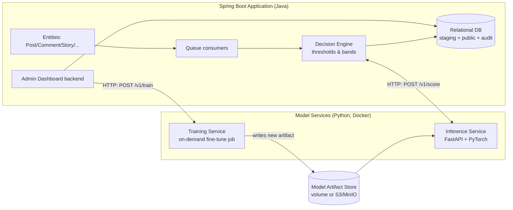
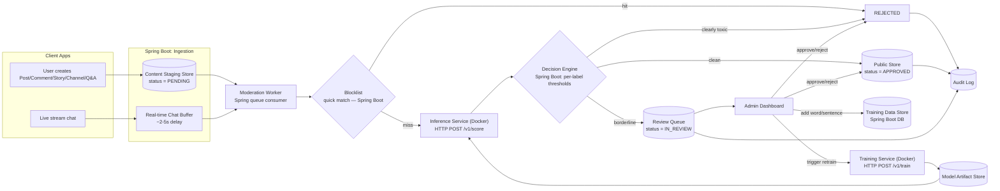
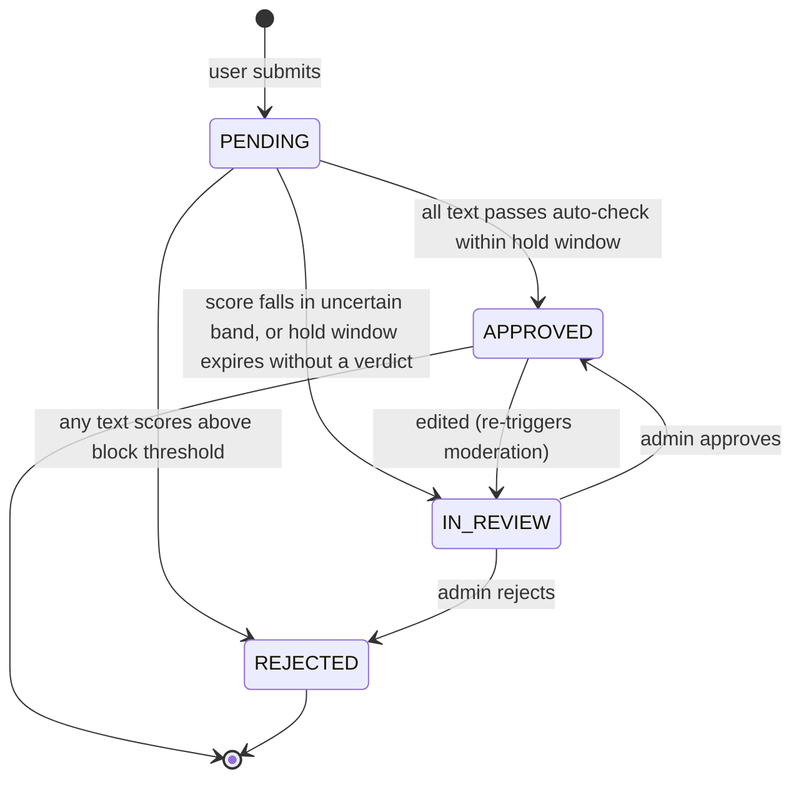
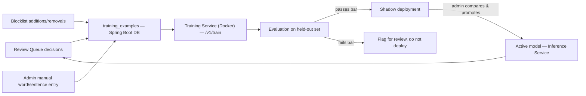

# Automated Text Moderation System — Roadmap & Documentation

**Scope:** Full design for integrating a fine-tuned toxicity classifier into a multi-purpose
social platform (posts, comments, channels, stories, research/articles, Q&A, live streaming
chat), with **automatic moderation as the default path**, a **delayed "hold-then-publish"
pipeline** for every entity, and an **admin dashboard** that supports both manual review and
fine-tuning/retraining the model on new words and sentences.

**Deployment model:** the platform's core application — entities, database, business rules,
queues, and the admin dashboard backend — is a **Spring Boot** service. The model itself is
Python/PyTorch and runs as an **independent, Dockerized inference microservice** that Spring
Boot calls over an internal HTTP API. This document is written entirely around that split.

**Text only.** Images, audio, and video frames are explicitly out of scope for this model. If
the platform needs image/video moderation later, that is a separate model and pipeline; this
document does not cover it, but Section 15 explains how to slot one in without breaking this
design.

**Reference implementation:** `docs/model-inference/` (the FastAPI scoring container, Section 7),
`docs/model-training/` (the fine-tuning container, Section 12.4) and the `ak.dev.irc.app.moderation`
package in this Spring Boot app (Sections 5, 8, 11, 12) are the working implementation of the
design below.

---

## Implementation status

> **This design is built.** Phases 0–5 are implemented as of 2026-08-08. What follows is the
> design document, kept as written; the sections it describes are cited from the code as `§n`.
>
> - **What was actually built, and where** → [`architecture.md`](architecture.md)
> - **Running the queue, tuning, teaching, promoting** → [`admin-guide.md`](admin-guide.md)
> - **Every endpoint** → [`api.md`](api.md)
> - **What users see** → [`frontend/`](frontend/README.md)
> - **Containers, failure modes, runbook** → [`operations.md`](operations.md)
>
> Six deviations from this document exist, each forced by a constraint of this codebase
> (no Resilience4j / webflux dependency, single-revision Cassandra post rows, an existing
> decision-log table). They are enumerated with rationale in
> [`architecture.md` §6](architecture.md#6-deviations-from-the-roadmap) rather than being
> quietly absorbed into the text below.
>
> **Section 18 still stands in full.** The seed dataset is still small, the model is still
> English-only, and the thresholds in Section 8.1 are still bootstrap defaults rather than
> values derived from a validation set. Building the pipeline did not solve any of that —
> see [`admin-guide.md` §9](admin-guide.md#9-before-this-goes-live-for-real-users).

---

## 0. The Model

### 0.1 What it is

A **fine-tuned `toxic-bert` (BERT-base) multi-label text classifier**. Given one input string,
it returns six independent probabilities (sigmoid outputs, not softmax — a text can trigger
several labels at once, or none):

```
toxic, severe_toxic, obscene, threat, insult, identity_hate
```

It was produced by fine-tuning the base checkpoint on a labeled dataset of `(text, 6 binary
labels)` rows using Hugging Face `transformers` + `Trainer`. The output of training is a
**portable artifact**: model weights (`safetensors`) + tokenizer files — nothing Java-specific,
nothing that depends on how it was trained.

### 0.2 Why it runs in its own container, not inside Spring Boot

PyTorch, the Hugging Face `transformers` tokenizer/model classes, and the training tooling are
Python-native. There is no equivalent-quality first-class Java runtime for this exact model
without either (a) exporting to ONNX and using a JVM ONNX runtime, or (b) keeping it in Python.
For a system that also needs to **retrain on new admin-provided data** regularly (Section 12),
staying in Python end-to-end (train and serve with the same libraries) is the lower-maintenance
choice. So the model is packaged as its own service, and the language boundary is handled the
normal way distributed systems handle polyglot components: **a private REST API over Docker's
internal network**, not a shared process.



**Division of responsibility — important, keep this boundary strict:**

| Owned by Spring Boot | Owned by the Python model services |
|---|---|
| Entities, staging table, state machine (Section 5) | Tokenization + model forward pass |
| Queueing, workers, SLA sweeper | Returning raw per-label probabilities |
| **Decision Engine** — thresholds, bands, blocklist (Section 8) | Training/fine-tuning on a labeled dataset |
| Admin dashboard REST API + persistence | Model versioning artifact I/O |
| Audit log, metrics, roles/permissions | Nothing else — it is a pure scorer |

The model service should be a **dumb, stateless scorer**: text in, six numbers out. It has no
opinion on what counts as "toxic enough to block" — that policy (thresholds, per-entity-type
overrides, blocklist) lives in Spring Boot, in the database, editable from the admin dashboard
**without redeploying the model container**. This is the single most important architectural
decision in this document: it means tuning sensitivity is a config change, not a Docker rebuild.

### 0.3 Current maturity — be explicit about this before relying on it

The seed training dataset behind the existing model artifact is small (on the order of two dozen
hand-written examples). That's enough to validate the pipeline end-to-end but **not enough to
trust for real auto-moderation decisions yet**. Section 17 covers exactly what's needed before
this goes live for real users; nothing below assumes that's already solved.

---

## 1. Executive Summary

Users create content across many entity types. Today, if unmoderated, any of these can go live
instantly and expose other users to toxic/abusive text before a human ever looks at it. The goal
of this system is:

1. **Nothing goes live instantly.** Every entity that contains user text passes through a
   moderation hold window before it becomes visible to anyone but its author.
2. **Moderation is automatic by default.** The toxicity model scores all text belonging to an
   entity; clean content is auto-published, clearly toxic content is auto-blocked, and only the
   uncertain middle band needs a human.
3. **Manual moderation is preserved, not replaced.** Admins/moderators can always review the
   queue, override a decision, ban words/phrases instantly, and — critically — **teach the
   model** by feeding it new labeled words and sentences from the dashboard.
4. **The model keeps improving.** Every admin correction and every manually labeled example
   becomes training data for the next fine-tuning run, which is itself triggered from the
   dashboard, versioned, evaluated, and deployed with a rollback path.
5. **The Java application and the Python model are cleanly separated services**, talking over a
   private HTTP API inside Docker, so each can be built, scaled, and deployed independently.

---

## 2. Entities in Scope

| Entity | Text fields to moderate | Notes |
|---|---|---|
| **Post** | title, body, hashtags/tags, alt-text of any linked media | Multiple sub-fields checked together (Section 6.4) |
| **Comment** | comment body (+ nested replies, each as its own unit) | High volume, needs a short hold window |
| **Channel** | channel name, description, pinned message, rules text | Long-lived — re-checked on every edit |
| **Story** | caption/overlay text | Ephemeral (e.g. 24h) — hold window must be short so it doesn't eat into the story's lifespan |
| **Research / Article** | title, abstract, body, section headings | Long text — chunking needed (Section 7.1) |
| **Q&A** | question text, answer text | Each answer moderated independently, question moderated independently |
| **Live streaming** | live chat messages, stream title/description, auto-captions if enabled | **Cannot use a long hold window** — needs the real-time variant of the pipeline (Section 7) |

Every entity type maps to the same underlying pipeline (Section 6); only the **hold duration**
and a couple of policy knobs differ per type (Section 6.3).

---

## 3. Guiding Principles

1. **Quarantine by default, publish by exception.** A record only becomes visible to other users
   once it has explicitly passed moderation (or the automated system has run out of options and a
   defined fallback policy allows it through — Section 6.6). Never the other way around.
2. **The model is a scorer, not a database.** Fast-changing "ban this word right now" needs
   (Section 12.2) are handled by a lightweight blocklist layer inside Spring Boot, not by waiting
   for a retrain.
3. **Every automated decision is explainable and reversible.** Store the per-label scores, the
   thresholds used, and the model version for every decision. Any admin can see why something was
   blocked and override it.
4. **Human corrections are first-class training signal.** An admin clicking "this was wrongly
   blocked" or "this should have been blocked" is the single highest-quality label the system can
   get — feed it back in, don't let it evaporate into a support ticket.
5. **Java and Python stay on their own sides of an HTTP boundary.** The model service never
   talks to the application database directly, and Spring Boot never imports PyTorch. All
   coupling is the versioned `/v1/score` and `/v1/train` contracts in Section 7.

---

## 4. High-Level Architecture



**Components:**

| Component | Runs as | Responsibility |
|---|---|---|
| Content Staging Store | Spring Boot / relational DB | Holds not-yet-public entities in `PENDING` state |
| Moderation Worker | Spring Boot (`@KafkaListener`/`@RabbitListener` or `@Async`) | Pulls staged entities off a queue, orchestrates blocklist + model calls |
| Blocklist Service | Spring Boot, in-memory cache backed by DB | Exact/fuzzy match against admin-curated deny-list; instant, no model call needed |
| **Inference Service** | **Docker container, Python (FastAPI + PyTorch)** | Pure scoring: text → 6 probabilities |
| Decision Engine | Spring Boot | Applies per-entity/per-label thresholds to model scores, emits a verdict |
| Review Queue | Spring Boot / relational DB | Entities in the uncertain band, waiting for a human |
| Admin Dashboard | Spring Boot REST API + any frontend (React/Angular/etc.) | Manual review UI + model/word management (Section 12) |
| Training Data Store | Spring Boot / relational DB | Superset of the seed dataset, append-only, versioned |
| **Training Service** | **Docker container, Python, on-demand job** | Runs a fine-tuning job against the current training data, produces a new artifact |
| Model Artifact Store | Shared Docker volume or object storage (S3/MinIO) | Holds every trained model version's weights |
| Audit Log | Spring Boot / relational DB | Immutable record of every decision, override, and retrain |

---

## 5. Core Concept: The Moderation Hold Window ("Quarantine-then-Publish")

This is the direct implementation of your requirement: *"adding posts and any of those entities
must not be done directly and uploading the record — it must, in a timeline duration, check all
texts belonging to that post, and then let the record be added."*

### 5.1 State machine

Every content unit (post, comment, channel, story, research item, Q&A item) goes through:



Only `APPROVED` records are readable by anyone other than the author (and, optionally, the
author sees their own content in a visibly "pending review" state — recommended for UX honesty
rather than silently hiding it).

### 5.2 What "hold window" means concretely

1. User submits a Post (or any entity) via the Spring Boot API. The API **does not write to the
   public table**. It writes to a staging row with `status = PENDING`, `submitted_at = now()`,
   and `hold_deadline = now() + entity_hold_duration`, inside the same transaction as the
   initial insert.
2. Spring Boot enqueues a moderation job immediately after commit (transactional outbox pattern
   recommended, so the message is never published for a row that failed to commit).
3. A worker collects **every text field belonging to that entity** (Section 5.4), calls the
   Inference Service once per field (or one batched call — Section 7.1), and applies the
   Decision Engine.
4. If a verdict (`APPROVED` or `REJECTED`) is reached **before** `hold_deadline`, the record is
   moved out of staging immediately — most clean content should publish in well under a second,
   the "duration" is a safety ceiling, not a mandatory wait.
5. If `hold_deadline` passes with no verdict (Inference Service degraded, backlog, timeout), apply
   the **fallback policy** (Section 5.6) — do not leave content silently stuck forever.

> The "timeline duration" is a **maximum wait**, not a fixed delay — don't make users wait 60
> seconds for a comment that clears in 80ms. It exists so slow/failed checks have a bounded,
> defined outcome instead of an indefinite one.

### 5.3 Recommended per-entity hold durations

| Entity | Target auto-decision time | Hard hold ceiling | Rationale |
|---|---|---|---|
| Comment | < 500 ms | 10 s | High volume, users expect near-instant feedback |
| Post | < 2 s | 30 s | Slightly more text (title+body+tags) |
| Story | < 1 s | 15 s | Ephemeral content, ceiling must stay small |
| Channel (create/edit) | < 2 s | 30 s | Low volume, can tolerate a bit more |
| Research/Article | < 5 s | 60 s | Long text, may need chunking (Section 7.1) |
| Q&A | < 2 s | 30 s | Same tier as posts |
| Live chat message | < 300 ms | 2–5 s buffer, not a queue hold | Real-time exception, see Section 7 |

These are config values in Spring Boot (`application.yml` or a DB-backed settings table editable
from the dashboard — Section 12.5), not hardcoded, and they double as the **timeout budget** for
the HTTP call to the Inference Service (Section 8.5) — the hold ceiling must always be greater
than the configured client timeout, with room for retries.

### 5.4 Multi-field aggregation — "all texts belonging to that post"

An entity is rarely a single string. A Post might have `title`, `body`, `tags[]`, and
`alt_text[]` for attached media. The rule: **the entity is not approved until every one of its
text fields is approved.**

```json
{
  "entity_id": "post_9f2a",
  "entity_type": "post",
  "fields": [
    {"field": "title", "text": "..."},
    {"field": "body", "text": "..."},
    {"field": "tag", "text": "..."},
    {"field": "tag", "text": "..."},
    {"field": "alt_text", "text": "..."}
  ]
}
```

The Spring Boot worker scores each field independently (so you know *which field* triggered a
block) but the **entity-level verdict is the worst of its field-level verdicts**:

- Any field `REJECTED` → entity `REJECTED`.
- No field rejected, but any field `IN_REVIEW` → entity `IN_REVIEW`.
- All fields `APPROVED` → entity `APPROVED`.

This also naturally handles threaded content like a Q&A answer with an inline follow-up, or a
post with a pre-attached first comment: treat each as its own entity in the same staging table,
linked by `parent_entity_id`, each with its own hold window.

### 5.5 Edits re-trigger moderation

An edit to an already-`APPROVED` entity must not silently go live unchecked. Two options,
pick based on UX tolerance:

- **Strict (recommended for Channels, Posts):** edited content reverts to `PENDING`, old version
  stays visible until the new version clears moderation (avoids visible flicker/hiding).
- **Lightweight (recommended for Comments):** edit is checked synchronously before being
  accepted; if it fails, the edit is rejected and the original text is kept, with an error
  shown to the user instead of an entity-level takedown.

### 5.6 Fallback policy when the hold window expires

Never leave an entity stuck in limbo indefinitely. Configure one of:

- **Fail-closed (recommended default for a moderation-first product):** on timeout, force
  `IN_REVIEW` and surface it at the top of the admin queue with an "SLA breached" flag. Content
  stays hidden from other users until a human looks at it.
- **Fail-open with shadow publish:** publish the content but flag it for priority review, and be
  ready to retroactively hide it if review fails it after the fact. Use only for low-risk entity
  types (e.g. Story) where availability matters more than the small residual risk, and only once
  the model's false-negative rate is well understood (Section 16).

Make this configurable per entity type — don't force one global policy. Implement it in Spring
Boot as a scheduled sweeper (`@Scheduled`, e.g. every 2–5 s) that finds `PENDING` rows past
`hold_deadline` and applies the configured policy — this must be resilient even if the Inference
Service is completely down.

---

## 6. Real-Time Exception: Live Streaming Chat

You cannot hold a live chat message in a queue for 10–30 seconds — it stops being "live." Use a
**rolling short buffer** in Spring Boot instead of the staging-table pattern:

```mermaid
sequenceDiagram
    participant U as Viewer
    participant B as Chat Buffer (Spring Boot, 2-5s)
    participant M as Inference Service (Docker)
    participant O as Other Viewers

    U->>B: sends chat message
    B->>M: POST /v1/score (low-latency path)
    alt clean or below threshold
        B->>O: release message after buffer delay
    else clearly toxic
        B-->>B: drop message, never released
        B->>O: (nothing shown)
    else borderline
        B-->>B: hold, flag to live moderator view
        Note over B: auto-hide by default; a moderator<br/>watching the live queue can release it<br/>within the buffer window if it's a false positive
    end
```

- Use a small, fixed buffer (2–5 seconds), not the entity-level hold-duration config from
  Section 5.3 — this is a UX/latency budget, not a review SLA.
- Requires the Inference Service to support a **low-latency single-message scoring path**
  distinct from the batch/queue path used for posts (Section 7.1).
- Borderline messages default to **hidden**, not shown — for live chat, false negatives are far
  more damaging than a delayed/dropped message, since there's no "review queue that catches up
  later" the way there is for a post.
- Stream title/description and pinned messages **do** go through the normal Section 5 pipeline —
  they're not real-time in the same sense.
- If auto-captions/transcription is added later, treat each caption chunk exactly like a chat
  message (same rolling buffer), not like a Research/Article.

---

## 7. The Inference Service (Dockerized Model Container)

### 7.1 API contract

This is the **entire surface area** the Python side exposes to Spring Boot. Keep it small and
stable — everything else (thresholds, entity types, business rules) stays in Java.

```
POST /v1/score
Content-Type: application/json

{ "text": "..." }

200 OK
{
  "scores": {
    "toxic": 0.0421,
    "severe_toxic": 0.0011,
    "obscene": 0.0032,
    "threat": 0.0004,
    "insult": 0.0187,
    "identity_hate": 0.0009
  },
  "model_version": "v3",
  "inference_ms": 18
}
```

```
POST /v1/score/batch
{ "items": [ {"id": "field_1", "text": "..."}, {"id": "field_2", "text": "..."} ] }

200 OK
{ "results": [ {"id": "field_1", "scores": {...}}, {"id": "field_2", "scores": {...}} ], "model_version": "v3" }
```

```
GET /healthz     -> 200 once the model is loaded into memory and ready to serve
GET /readyz      -> 200 only when actively able to serve (used by Docker/K8s health checks)
```

Notes on implementation, independent of the exact framework used (FastAPI is the natural choice
for a PyTorch model service, but any Python HTTP framework works):

- Load the model **once at process startup**, keep it resident in memory for the life of the
  container — never reload per request.
- Run inference in evaluation mode with gradient tracking disabled, exactly as a scoring-only
  service should.
- Two entry points sharing the one loaded model:
  - `/v1/score` — single text, low latency, used by live chat (Section 6) and synchronous
    edit-checks (Section 5.5).
  - `/v1/score/batch` — array of texts, used by the Spring Boot queue worker for
    posts/comments/stories/etc., so N fields become one HTTP round-trip instead of N.
- **Chunking for long text** (Research/Article bodies): the tokenizer truncates beyond its max
  sequence length. For long-form content, split into overlapping chunks, score each chunk, and
  take the **max score per label across chunks** — do this either inside the Inference Service
  (if it should stay chunk-aware) or in the Spring Boot worker (if you want chunking policy to be
  tunable without touching the model container). Recommendation: keep it in the Inference Service
  since it's a property of the model's input limits, not a business rule.
- The service returns **raw scores only** — no `"decision"` field, no thresholds. Threshold logic
  belongs in Spring Boot's Decision Engine (Section 8) so sensitivity can be tuned from the admin
  dashboard without redeploying this container.

### 7.2 Dockerfile (the model container)

```dockerfile
FROM python:3.11-slim

WORKDIR /app
COPY requirements.txt .
RUN pip install --no-cache-dir -r requirements.txt

# Model artifact is baked in at build time for a pinned version,
# or mounted as a volume at /app/model to support hot-swapping versions (see 12.4)
COPY model/ ./model/
COPY app/ ./app/

EXPOSE 8000
HEALTHCHECK --interval=10s --timeout=3s --start-period=30s \
  CMD curl -f http://localhost:8000/healthz || exit 1

CMD ["uvicorn", "app.main:app", "--host", "0.0.0.0", "--port", "8000", "--workers", "1"]
```

`--workers 1` per container is deliberate: PyTorch models are memory-heavy, so scale out by
**running more container replicas** behind a load balancer rather than more workers inside one
container (Section 7.5).

### 7.3 docker-compose sketch (local/dev topology)

```yaml
services:
  postgres:
    image: postgres:16
    environment:
      POSTGRES_DB: moderation
    volumes: [pgdata:/var/lib/postgresql/data]

  rabbitmq:
    image: rabbitmq:3-management

  model-inference:
    build: ./model-inference
    ports: ["8000:8000"]
    volumes:
      - model-artifacts:/app/model   # shared with training service
    healthcheck:
      test: ["CMD", "curl", "-f", "http://localhost:8000/healthz"]

  model-training:
    build: ./model-training
    volumes:
      - model-artifacts:/app/model
      - training-data:/app/data
    profiles: ["on-demand"]   # not started by default; triggered as a job (Section 12.4)

  spring-boot-app:
    build: ./spring-boot-app
    ports: ["8080:8080"]
    environment:
      MODERATION_INFERENCE_URL: http://model-inference:8000
      MODERATION_TRAINING_URL: http://model-training:8001
      SPRING_DATASOURCE_URL: jdbc:postgresql://postgres:5432/moderation
      SPRING_RABBITMQ_HOST: rabbitmq
    depends_on:
      model-inference: { condition: service_healthy }
      postgres: { condition: service_started }

volumes:
  pgdata:
  model-artifacts:
  training-data:
```

Both `model-inference` and `spring-boot-app` sit on the same Docker network; Spring Boot reaches
the model purely by its service name (`http://model-inference:8000`) — no public exposure needed
beyond `8080` for the app itself and `5432`/management ports for local debugging.

### 7.4 Spring Boot client side

Define the moderation call as a normal outbound HTTP client — `WebClient` (reactive) or a
`RestClient`/Feign client (imperative) both work; `WebClient` shown here since the batch call
benefits from non-blocking I/O under load:

```java
@Configuration
public class ModerationClientConfig {

    @Bean
    public WebClient moderationWebClient(
            @Value("${moderation.inference.base-url}") String baseUrl,
            @Value("${moderation.inference.timeout-ms}") long timeoutMs) {

        HttpClient httpClient = HttpClient.create()
                .responseTimeout(Duration.ofMillis(timeoutMs));

        return WebClient.builder()
                .baseUrl(baseUrl)
                .clientConnector(new ReactorClientHttpConnector(httpClient))
                .build();
    }
}
```

```java
public record ScoreRequest(String text) {}

public record ScoreResponse(
        Map<String, Double> scores,
        String modelVersion,
        long inferenceMs) {}

@Service
public class ModerationInferenceClient {

    private final WebClient webClient;

    public ModerationInferenceClient(WebClient moderationWebClient) {
        this.webClient = moderationWebClient;
    }

    @CircuitBreaker(name = "moderationInference", fallbackMethod = "onInferenceUnavailable")
    @Retry(name = "moderationInference")
    public Mono<ScoreResponse> score(String text) {
        return webClient.post()
                .uri("/v1/score")
                .bodyValue(new ScoreRequest(text))
                .retrieve()
                .bodyToMono(ScoreResponse.class);
    }

    private Mono<ScoreResponse> onInferenceUnavailable(String text, Throwable ex) {
        // Inference Service is down/slow — do not silently approve.
        // Surface as "no verdict"; the SLA sweeper (5.6) routes this to IN_REVIEW.
        return Mono.error(new InferenceUnavailableException(ex));
    }
}
```

```yaml
# application.yml
moderation:
  inference:
    base-url: ${MODERATION_INFERENCE_URL:http://model-inference:8000}
    timeout-ms: 1500
  training:
    base-url: ${MODERATION_TRAINING_URL:http://model-training:8001}

resilience4j:
  circuitbreaker:
    instances:
      moderationInference:
        sliding-window-size: 20
        failure-rate-threshold: 50
        wait-duration-in-open-state: 10s
  retry:
    instances:
      moderationInference:
        max-attempts: 2
        wait-duration: 200ms
```

Wire **Resilience4j** (timeout + retry + circuit breaker) around every call to the Inference
Service. This is not optional: the model container is now a hard dependency sitting in the
critical path of content creation, and Section 5.6's fallback policy only works correctly if
Spring Boot can reliably detect "the model didn't answer in time" versus "the model said it's
clean."

### 7.5 Scaling the Inference Service independently

Because it's a separate container, it scales on its own axis from the Spring Boot app:

- Run multiple `model-inference` replicas behind a load balancer (Docker Swarm service
  replicas, or a Kubernetes `Deployment` + `Service` + `HorizontalPodAutoscaler` keyed on CPU or
  request latency).
- A single ~128-token forward pass through a BERT-base model is fast enough on CPU for the
  latency targets in Section 5.3 at moderate volume; move to GPU-backed replicas only once
  sustained throughput requires it.
- Spring Boot's `WebClient`/circuit breaker config (7.4) is agnostic to how many replicas sit
  behind `MODERATION_INFERENCE_URL` — that's the load balancer's job, not the client's.

---

## 8. Decision Engine (lives in Spring Boot)

### 8.1 Threshold bands

Don't use a single blanket cutoff. Use **two thresholds per label**, creating three bands,
evaluated in Spring Boot right after the `/v1/score` response comes back:

| Band | Condition | Outcome |
|---|---|---|
| Auto-approve | all labels below `low_threshold` | `APPROVED` |
| Needs review | any label between `low_threshold` and `high_threshold` | `IN_REVIEW` |
| Auto-block | any label at/above `high_threshold` | `REJECTED` |

Example starting config (tune per label using a held-out validation set once the dataset is
larger — see Section 17):

```yaml
moderation:
  thresholds:
    toxic:          { low: 0.30, high: 0.80 }
    severe_toxic:   { low: 0.20, high: 0.60 }
    obscene:        { low: 0.30, high: 0.80 }
    threat:         { low: 0.15, high: 0.50 }   # lower bar — false negatives on threats are worse
    insult:         { low: 0.30, high: 0.80 }
    identity_hate:  { low: 0.15, high: 0.55 }   # lower bar, same reasoning
```

- Thresholds should be **per entity type as well as per label** where policy differs — e.g. a
  Research/Article field might tolerate a higher `insult` threshold than public Comments because
  academic critique legitimately uses sharper language, while `threat`/`identity_hate` stay
  strict everywhere.
- Store thresholds in a Spring Boot–owned settings table, editable from `/admin/settings/*`
  (Section 9.3), **not in `application.yml`** for production — that's what lets admins tune
  sensitivity live without a redeploy of either service. `application.yml` values above are a
  sane bootstrap default only.

### 8.2 Blocklist layer (instant effect, no model call)

For "ban this exact word/phrase right now" needs where waiting for a retrain is unacceptable
(e.g. a new slur starts trending), keep a simple deny-list in Spring Boot, checked **before**
calling the Inference Service:

- Exact + normalized match (lowercase, strip punctuation/leetspeak substitutions, collapse
  repeated characters — e.g. "id10t", "1d10t", "iiiidiot" should all normalize toward "idiot").
- Managed entirely from the dashboard (Section 12.2), takes effect immediately — pure DB write,
  no deploy, no model container restart needed.
- Two blocklist tiers:
  - **Hard block** — presence anywhere in the text → immediate `REJECTED`, the Inference Service
    is never even called for that field, saving latency and load.
  - **Soft flag** — presence → forces `IN_REVIEW` even if the model alone would have approved,
    useful for words that are context-dependent (medical terms, reclaimed slurs, etc.).
- Cache the active blocklist in memory in each Spring Boot instance (Caffeine/local cache),
  refreshed on a short TTL or invalidated via a pub/sub message when the dashboard edits it — this
  check runs before every single field, so it needs to be effectively free.

---

## 9. Data Model (Spring Boot / JPA)

Minimum schema to support everything above. Illustrative SQL (map to `@Entity` classes with
standard Spring Data JPA repositories):

```sql
-- One row per submitted content unit (post, comment, story, ...)
CREATE TABLE moderation_entities (
    id              UUID PRIMARY KEY,
    entity_type     TEXT NOT NULL,         -- 'post' | 'comment' | 'channel' | 'story' | 'article' | 'qna_question' | 'qna_answer'
    parent_id       UUID NULL,             -- for threaded content (answer -> question, reply -> comment)
    author_id       UUID NOT NULL,
    status          TEXT NOT NULL,         -- PENDING | APPROVED | REJECTED | IN_REVIEW
    submitted_at    TIMESTAMPTZ NOT NULL,
    hold_deadline   TIMESTAMPTZ NOT NULL,
    decided_at      TIMESTAMPTZ NULL,
    decided_by      TEXT NULL,             -- 'system' | admin_user_id
    model_version   TEXT NULL
);

-- One row per text field within an entity
CREATE TABLE moderation_fields (
    id              UUID PRIMARY KEY,
    entity_id       UUID REFERENCES moderation_entities(id),
    field_name      TEXT NOT NULL,         -- 'title' | 'body' | 'tag' | 'alt_text' | ...
    text            TEXT NOT NULL,
    status          TEXT NOT NULL,         -- APPROVED | REJECTED | IN_REVIEW
    scores          JSONB NOT NULL,        -- {"toxic": 0.04, "severe_toxic": 0.00, ...} — raw output from the Inference Service
    blocklist_hit   TEXT NULL              -- matched term, if any
);

-- Admin-curated deny-list
CREATE TABLE blocklist_terms (
    id              UUID PRIMARY KEY,
    term            TEXT NOT NULL,
    match_type      TEXT NOT NULL,         -- 'exact' | 'normalized' | 'regex'
    severity        TEXT NOT NULL,         -- 'hard_block' | 'soft_flag'
    added_by        UUID NOT NULL,
    added_at        TIMESTAMPTZ NOT NULL,
    active          BOOLEAN DEFAULT TRUE
);

-- Grows from admin dashboard submissions; sent to the Training Service on retrain
CREATE TABLE training_examples (
    id              UUID PRIMARY KEY,
    text            TEXT NOT NULL,
    toxic           SMALLINT NOT NULL,
    severe_toxic    SMALLINT NOT NULL,
    obscene         SMALLINT NOT NULL,
    threat          SMALLINT NOT NULL,
    insult          SMALLINT NOT NULL,
    identity_hate   SMALLINT NOT NULL,
    source          TEXT NOT NULL,         -- 'seed_dataset' | 'admin_manual' | 'admin_correction' | 'user_report_confirmed'
    added_by        UUID NULL,
    added_at        TIMESTAMPTZ NOT NULL
);

-- Every trained model artifact produced by the Training Service
CREATE TABLE model_versions (
    id              TEXT PRIMARY KEY,      -- 'v1', 'v2', ...
    trained_at      TIMESTAMPTZ NOT NULL,
    training_examples_count INTEGER NOT NULL,
    base_checkpoint TEXT NOT NULL,         -- e.g. previous version or the original base model
    eval_metrics    JSONB NOT NULL,        -- precision/recall/F1 per label on held-out set
    status          TEXT NOT NULL,         -- 'training' | 'evaluating' | 'shadow' | 'active' | 'retired' | 'failed'
    artifact_path   TEXT NOT NULL          -- path in the shared volume / object store
);

-- Immutable audit trail
CREATE TABLE moderation_audit_log (
    id              UUID PRIMARY KEY,
    entity_id       UUID NOT NULL,
    action          TEXT NOT NULL,         -- 'auto_approved' | 'auto_rejected' | 'sent_to_review' | 'admin_approved' | 'admin_rejected' | 'sla_breach_fallback'
    actor           TEXT NOT NULL,         -- 'system' | admin_user_id
    detail          JSONB NULL,
    created_at      TIMESTAMPTZ NOT NULL
);
```

All of these tables live in the Spring Boot application's own database. The Python services never
connect to it directly — the Training Service receives its training set over HTTP (Section 12.4)
rather than querying Postgres itself, keeping the two systems fully decoupled.

---

## 10. API Specification

### 10.1 Public-facing content APIs (Spring Boot, unchanged contract, changed behavior)

Your existing "create post/comment/etc." endpoints keep the same request/response shape from the
client's point of view, but internally:

```
POST /api/posts
201 Created
{
  "id": "post_9f2a",
  "status": "PENDING",       // NEW — not visible to others yet
  "estimated_review_time_ms": 1800
}
```

Clients poll or subscribe (websocket/push) for the status transition:

```
GET /api/posts/post_9f2a/status
200 OK
{ "status": "APPROVED" }   // or REJECTED / IN_REVIEW, with a reason code if rejected
```

### 10.2 Inference Service API (Python container — see Section 7.1 for full detail)

```
POST   /v1/score            — single text, synchronous, low latency (live chat, edits)
POST   /v1/score/batch      — array of texts, used by queue workers
GET    /healthz / /readyz   — container health checks
```

### 10.3 Training Service API (Python container — see Section 12.4)

```
POST   /v1/train            { "training_data_url": "...", "base_checkpoint": "v3" }
GET    /v1/train/{job_id}   — status: queued | training | evaluating | done | failed
```

### 10.4 Admin Dashboard API (Spring Boot)

```
GET    /admin/queue                 — paginated review queue (filter by entity_type, SLA breach, label)
POST   /admin/queue/{entity_id}/approve
POST   /admin/queue/{entity_id}/reject   { "reason": "..." }

GET    /admin/blocklist
POST   /admin/blocklist             { "term": "...", "match_type": "...", "severity": "..." }
DELETE /admin/blocklist/{id}

POST   /admin/training-examples     { "text": "...", "labels": {...} }     -- single word or sentence
GET    /admin/training-examples     — paginated, filterable by source

POST   /admin/model/retrain         { "notes": "..." }   -- Spring Boot calls the Training Service's /v1/train
GET    /admin/model/versions
POST   /admin/model/versions/{id}/promote     -- make this the active production model
POST   /admin/model/versions/{id}/rollback

GET    /admin/settings/thresholds
PUT    /admin/settings/thresholds
GET    /admin/settings/hold-durations
PUT    /admin/settings/hold-durations

GET    /admin/metrics               -- dashboard analytics (Section 12.5)
```

---

## 11. Ingestion Pipeline / Queue Architecture

```
Client → Spring Boot API → write PENDING row (DB tx) → publish "moderation.requested" (outbox)
                                          │
                                          ▼
                     Spring Boot Moderation Worker(s) (@RabbitListener/@KafkaListener)
                                          │
                         ┌────────────────┼─────────────────┐
                         ▼                ▼                 ▼
                 Blocklist check    HTTP call to        Decision Engine
                 (in-process)       Inference Service    (in-process)
                         │                │                 │
                         └────────────────┴────────┬────────┘
                                                     ▼
                                     Update row → publish "moderation.decided"
                                                     │
                          ┌──────────────────────────┼──────────────────────────┐
                          ▼                           ▼                          ▼
                 Notify client (status)     Move to public store        Push to Review Queue
                                             (if APPROVED)               (if IN_REVIEW)
```

- RabbitMQ or Kafka both work well with Spring (`spring-boot-starter-amqp` /
  `spring-kafka`) — pick based on what's already in your stack. Use at-least-once delivery with a
  dead-letter queue for messages the worker fails to process (route those to `IN_REVIEW` with an
  `error` audit entry, never drop silently).
- Workers are just Spring Boot listener beans — scale by running more application instances
  (or a dedicated "worker" deployment profile of the same Spring Boot image, separate from the
  instances serving public API traffic).
- The **SLA sweeper** (`@Scheduled`, every few seconds) finds `PENDING` rows past `hold_deadline`
  with no decision and applies the fallback policy (Section 5.6) — this runs independent of the
  queue, so it still works if a message was lost or the Inference Service was down for the whole
  window.

---

## 12. Admin Dashboard

### 12.1 Moderation Queue & Review

- List of `IN_REVIEW` entities, sortable by SLA-breach risk, entity type, and highest triggered
  label score.
- Each item shows: full text (all fields), per-label scores with the threshold band visualized,
  which threshold band caused the review (near-`high`? blocklist soft-flag?), author history
  (past violations), and one-click **Approve** / **Reject** (with a required reason on reject).
- Bulk actions for high-confidence batches (e.g. "approve all with max score < 0.4").

### 12.2 Blocklist / Word Manager

- Add/remove single words or short phrases, choose `hard_block` vs `soft_flag`, exact vs
  normalized matching.
- Search/filter existing terms, see hit-count analytics per term (is this rule actually firing?
  is it firing too often — possible false positives?).
- Changes apply **immediately** — a plain write to `blocklist_terms`, no deploy or retrain
  required. This is the fast lever; model retraining (12.4) is the slow, higher-quality lever.

### 12.3 Fine-Tuning / Training Data Manager — *this is the "teach it new text and words" feature*

- **Add single word:** simple form — word, which labels it implies, optional context note. Under
  the hood this inserts one or more short synthetic sentences into `training_examples` (a bare
  word is a weak training signal on its own for a sentence-level classifier; the UI can
  auto-wrap it into a couple of template sentences, e.g. "You are a `<word>`.", while still
  storing the raw word for the blocklist/normalization layer in 12.2 to use immediately).
- **Add full sentence/example:** text box + checkboxes for each of the 6 labels — a single
  labeled training row.
- **Review-queue promotion:** every admin approve/reject in 12.1 optionally gets one-click
  "also add this as a training example with these labels" — this is the highest-leverage source
  of new training data because it's real, in-product content the model got wrong or was unsure
  about (Section 13).
- **Dataset browser:** paginated, filterable view over `training_examples` (filter by source,
  label, date), with edit/delete for correcting bad labels before they get trained on.
- **Trigger retrain:** button that calls Spring Boot's `/admin/model/retrain`, which in turn
  calls the Training Service's `POST /v1/train` (Section 12.4) with the current dataset. Shows
  live/polling status (queued → training → evaluating → ready for promotion).

### 12.4 Model Version Management & the Training Service

The **Training Service** is a second Python container — either a separate image, or the same
image as the Inference Service with a different entrypoint/profile — whose only job is to run a
fine-tuning job on demand:

```
Admin clicks "Retrain"
   → Spring Boot POST /admin/model/retrain
   → Spring Boot exports current `training_examples` table to a file/URL the Training
     Service can read (or POSTs the rows directly in the request body for smaller datasets)
   → Spring Boot calls Training Service POST /v1/train { training_data_url, base_checkpoint }
   → Training Service fine-tunes, writes a new artifact to the shared volume / object store,
     evaluates it against a held-out split, and returns metrics + a new version id
   → Spring Boot records a new row in `model_versions` with status = 'evaluating'
```

- Run this as a genuine background job, not a synchronous HTTP request held open for the
  duration of training — either poll `GET /v1/train/{job_id}` from Spring Boot, or have the
  Training Service call back to a Spring Boot webhook (`POST /admin/model/train-callback`) when
  done.
- **Shadow mode:** a newly trained model can be promoted to `shadow` — a second Inference Service
  replica pool loads that version and scores live traffic in parallel with `active`, its decisions
  logged but not enforced, so admins can compare its behavior before trusting it.
- **Promote:** admin clicks promote in the dashboard → Spring Boot updates `model_versions.status`
  and points `MODERATION_INFERENCE_URL` (or a routing header, if `active` and `shadow` share a
  pool) at the new version. In practice this means either (a) restarting/rolling the
  `model-inference` deployment with the new artifact mounted, or (b) building a hot-reload
  endpoint on the Inference Service (`POST /v1/reload {version}`) that swaps the in-memory model
  without a container restart — cheaper, but requires the service to briefly queue/reject
  requests during the swap.
- **Rollback:** one click to re-point back at any `retired` version's artifact — critical safety
  valve if a retrain regresses on some label. Since artifacts are versioned and kept in the shared
  store, rollback never depends on re-running training.
- Never let a retrain auto-promote itself. Require a human "promote" click, gated on the
  evaluation metrics clearing a minimum bar (configurable, e.g. "F1 per label must not drop more
  than 2 points versus current active version").

### 12.5 Analytics & Metrics

- Volume: entities submitted / approved / rejected / sent to review, per entity type, over time.
- Model health: score distribution per label, band breakdown (% auto-approved vs review vs
  auto-blocked) — a healthy system should auto-decide the large majority of traffic; if
  `IN_REVIEW` volume creeps up, thresholds or the model itself need attention.
- SLA: % of entities decided before `hold_deadline`, breach count per entity type, plus
  Inference Service latency/error rate (surfaced via the circuit breaker's metrics — Resilience4j
  exposes these to Micrometer/Actuator out of the box).
- Admin agreement rate: % of `IN_REVIEW` items where the admin's decision matched what the model
  would have done at a stricter/looser threshold — useful signal for threshold tuning.
- Blocklist term hit-rates (Section 12.2).

### 12.6 Roles & Permissions

| Role | Queue review | Blocklist edit | Add training examples | Trigger retrain | Promote/rollback model | Edit thresholds |
|---|---|---|---|---|---|---|
| Moderator | ✅ | ✅ | ✅ (suggest only, needs approval) | ❌ | ❌ | ❌ |
| Content Admin | ✅ | ✅ | ✅ | ✅ | ❌ | ✅ |
| ML/Platform Admin | ✅ | ✅ | ✅ | ✅ | ✅ | ✅ |

Every action in every role is written to `moderation_audit_log` with the acting user's id — no
anonymous admin actions. Enforce roles with standard Spring Security method-level annotations
(`@PreAuthorize`) on the admin controllers.

---

## 13. Continuous Learning Loop

This is what makes "auto" moderation get better over time instead of staying frozen at the seed
dataset:



Recommended cadence: retrain **on demand** (triggered from the dashboard whenever there's a
meaningful batch of new examples — e.g. 50+), rather than on a rigid schedule, since a small
platform won't generate enough new labeled data daily to justify nightly retraining. Once volume
is high, move to a scheduled job (a Spring Boot `@Scheduled` task calling the same
`/admin/model/retrain` flow) with the same evaluate → shadow → promote gate.

---

## 14. Non-Text Content — Explicitly Out of Scope

This model only sees text. It will not catch toxicity conveyed purely through an image, a video
frame, or audio in a live stream. Two things worth stating explicitly in this doc so it isn't
assumed to be covered:

- **Image/video moderation** needs a separate model (e.g. an image classifier or a multimodal
  model), ideally packaged the same way as this one — its own Dockerized inference service behind
  its own `/v1/score`-shaped API — and plugged into the *same* staging/hold-window pipeline
  (Section 5) as another parallel check an entity's `PENDING` state waits on. The state machine
  in Section 5.1 already generalizes to "all checks, of any modality, must pass."
- **Audio in live streams** (spoken toxicity) would need speech-to-text first, after which the
  transcribed text can be run through this exact pipeline via the live-chat real-time path
  (Section 6).

---

## 15. Security & Privacy

- Treat submitted text as user content: encrypt at rest in the staging store like you would any
  other user content, not just in the public store.
- The Inference Service and Training Service should sit on the **internal Docker network only** —
  never expose `model-inference:8000` or `model-training:8001` outside the container network;
  only Spring Boot's public-facing ports should be reachable externally.
- The admin/review APIs must never expose raw user text to anyone without a moderation role — the
  review queue is an internal tool, enforced by Spring Security.
- Audit log entries should retain enough to reconstruct any decision, but avoid over-collecting —
  don't log unrelated user PII alongside moderation text unless it's specifically needed for the
  decision.
- Retraining on real user-submitted content should be covered by your platform's data-use policy
  / ToS (moderation is a legitimate/expected use, but say so explicitly to users) — get sign-off
  from whoever owns privacy/legal policy before wiring "flagged user content" into
  `training_examples` at scale.
- Rate-limit calls into the Inference Service from Spring Boot — it's now a hard dependency
  sitting in the critical path of every piece of content creation; an outage or slowdown there
  should degrade gracefully via the circuit breaker (Section 7.4) and the SLA fallback
  (Section 5.6), not take down content creation platform-wide.

---

## 16. Performance & Scaling

- Inference for a single ~128-token text on CPU is fast enough for the target latencies in
  Section 5.3 (BERT-base, single sequence, no batching, generally tens of milliseconds); GPU only
  becomes necessary at high sustained throughput or once chunking (Section 7.1) multiplies calls
  per request.
- Scale the Spring Boot worker instances and the Inference Service **independently** — they're
  separate containers/deployments with different resource profiles (JVM heap vs PyTorch model
  memory), so right-size and autoscale each on its own metrics.
- Cache blocklist terms in-memory in each Spring Boot instance, refreshed on a short TTL or via a
  pub/sub invalidation message when the dashboard adds/removes a term — the blocklist check needs
  to be effectively free since it runs before every Inference Service call.
- Use `/v1/score/batch` from the queue worker whenever an entity has multiple fields (Section
  5.4) — one HTTP round-trip per entity instead of one per field cuts both latency and Inference
  Service load significantly at scale.

---

## 17. Testing Strategy

- **Unit tests** on the Decision Engine (Spring Boot): given fixed scores, assert correct band
  classification for every threshold boundary (`== low`, `== high`, between, above).
- **Contract tests** between Spring Boot and the Inference Service: a Pact/WireMock-based test
  verifying the `/v1/score` request/response shape stays compatible across model container
  versions, so a Python-side change can't silently break the Java client.
- **Golden set regression tests**: a fixed, hand-reviewed set of texts that every new model
  version must be scored against before promotion — catches silent regressions a single aggregate
  F1 number can hide. Run this as part of the Training Service's evaluation step (Section 12.4).
- **Adversarial/evasion tests**: leetspeak, spacing (`i d i o t`), homoglyphs, zero-width
  characters — decide whether normalization happens before the model (blocklist layer, Spring
  Boot side) and/or needs augmented training data so the model itself learns robustness.
- **Load tests** on the full path — Spring Boot API → queue → Inference Service — at expected
  peak comment/post volume, verifying p95/p99 latency stays under the hold-duration targets in
  Section 5.3, and that the circuit breaker opens/recovers correctly under induced Inference
  Service failure.
- **Live-chat buffer tests**: verify the 2–5s buffer path meets latency budget under load and
  that borderline messages default to hidden as specified in Section 6.

---

## 18. Known Limitations of the Current Model — Immediate Next Steps

Being direct about where things stand today, since this roadmap is meant to be actionable:

1. **The seed training dataset is small** — on the order of two dozen hand-written examples.
   This is a proof-of-concept size, not a production training set. Before relying on
   auto-decisions in production, expand it with an established labeled corpus using the same 6
   labels this model already predicts (e.g. the Jigsaw Toxic Comment Classification dataset),
   plus your own platform's admin-corrected examples over time (Section 13).
2. **English-only**, inherited from the base checkpoint's training. If the platform is
   multilingual, either fine-tune per-language models (each as its own versioned artifact served
   by the same Inference Service, routed by a `language` field) or move to a multilingual base
   checkpoint — flag this explicitly to stakeholders before launch in non-English markets.
3. **Fixed max input length** — fine for comments/short posts, insufficient for Research/Article
   bodies without the chunking strategy in Section 7.1.
4. **No held-out evaluation split in the current training process** — before wiring up the
   shadow/promote gate in Section 12.4, the Training Service must split `training_examples` into
   train/validation (e.g. 85/15, stratified by label) so `eval_metrics` in `model_versions` means
   something.
5. **A single global 0.5 cutoff was used during initial model development** — fine for a quick
   sanity check, replace with the per-label, per-entity-type threshold config from Section 8.1 in
   the production Decision Engine before launch.

---

## 19. Phased Implementation Roadmap

> **Status, 2026-08-08.** Phases 0–5 are implemented. The one item still genuinely
> outstanding is the *data* work in Phase 0 — expanding the training set beyond the seed
> examples and deriving thresholds from a real validation set (Section 18). The
> infrastructure for both exists and is wired; what is missing is a corpus, which is a
> curation task rather than an engineering one.
>
> | Phase | State | Where |
> |---|---|---|
> | 0 — Inference container, `/v1/score`, `/v1/score/batch`, health, chunking, hot reload | **Built** | `docs/model-inference/` |
> | 0 — Held-out validation split, per-label P/R/F1 | **Built** | `docs/model-training/` (stratified rarest-label-first) |
> | 0 — Expand training data beyond the seed set | **Outstanding** | needs a labeled corpus |
> | 1 — Staging + state machine, worker, Resilience, review queue, audit, compose topology | **Built** | `moderation/`, `AdminAutoModerationController` |
> | 2 — Channels, stories, research (chunked), Q&A, per-entity policy, multi-field batching | **Built** | 13 entity types in `ModeratedEntityType` |
> | 3 — Live-stream real-time path | **Built** | inline 300ms budget, borderline-hidden default |
> | 4 — Blocklist, training-example manager, Training Service, registry, gate, promote/rollback | **Built** | `AdminModerationModelController`, `docs/model-training/` |
> | 5 — Continuous learning + analytics | **Built** | `teachModel` on every decision, `/review/metrics` |

### Phase 0 — Harden the model + stand up the Inference Service container (1–2 weeks)
- Expand training data well beyond the current seed set (Jigsaw dataset + manual curation).
- Add a held-out validation split to the training process; compute per-label precision/recall/F1.
- Build the Inference Service: FastAPI + PyTorch, `/v1/score`, `/v1/score/batch`,
  `/healthz`/`/readyz`, Dockerfile (Section 7.2).
- Define initial per-label thresholds (Section 8.1) using the validation set.

### Phase 1 — MVP quarantine pipeline for Posts & Comments (2–3 weeks)
- Spring Boot: Content Staging Store + state machine (Section 5.1) for these two entity types.
- Spring Boot Moderation Worker calling the Inference Service, with Resilience4j
  timeout/retry/circuit-breaker (Section 7.4).
- Basic Review Queue UI (list + approve/reject) — no fine-tuning UI yet.
- Audit log.
- docker-compose topology wiring Spring Boot + Inference Service + Postgres + broker
  (Section 7.3).

### Phase 2 — Extend to remaining entities (2 weeks)
- Channels, Stories, Research/Article (with chunking), Q&A.
- Per-entity hold durations and threshold overrides configured (Section 5.3, 8.1).
- Multi-field aggregation (Section 5.4) fully implemented for Posts/Articles, using
  `/v1/score/batch`.

### Phase 3 — Live streaming real-time path (2 weeks)
- Rolling chat buffer in Spring Boot + low-latency single-message calls to `/v1/score`
  (Section 6).
- Live moderator view for borderline messages.

### Phase 4 — Admin dashboard: blocklist + fine-tuning workflow + Training Service (2–3 weeks)
- Blocklist manager with hard/soft terms (Section 12.2).
- Training example manager: add single word / add sentence / promote from review queue
  (Section 12.3).
- Stand up the Training Service container; wire Spring Boot's "Retrain" button to it
  (Section 12.4).
- Model Registry + evaluation gate, shadow deployment, promote/rollback.

### Phase 5 — Continuous learning & analytics (ongoing)
- Full loop from Section 13 running end-to-end.
- Analytics dashboard (Section 12.5).
- Regular review of golden-set regression results and threshold tuning based on admin agreement
  rate.

---

## 20. Configuration Reference (summary)

```yaml
# Spring Boot application.yml
moderation:
  inference:
    base-url: ${MODERATION_INFERENCE_URL:http://model-inference:8000}
    timeout-ms: 1500
  training:
    base-url: ${MODERATION_TRAINING_URL:http://model-training:8001}
  hold_duration:
    comment: 10s
    post: 30s
    story: 15s
    channel: 30s
    article: 60s
    qna: 30s
  fallback_policy:
    comment: fail_closed
    post: fail_closed
    story: fail_open_shadow
    channel: fail_closed
    article: fail_closed
    qna: fail_closed
  live_chat:
    buffer_seconds: 3
    borderline_default: hidden
  thresholds:
    toxic:         { low: 0.30, high: 0.80 }
    severe_toxic:  { low: 0.20, high: 0.60 }
    obscene:       { low: 0.30, high: 0.80 }
    threat:        { low: 0.15, high: 0.50 }
    insult:        { low: 0.30, high: 0.80 }
    identity_hate: { low: 0.15, high: 0.55 }
  retrain:
    min_promotion_bar: "no per-label F1 drop > 2 points vs active"
    require_human_promote: true
```

Bootstrap defaults live in `application.yml`; **hold durations and thresholds should be
overridable at runtime** from a DB-backed settings table via `/admin/settings/*` (Section 10.4)
so admins can tune the system without a code deploy.

---

## 21. Glossary

- **Entity** — any user-created content unit going through moderation (post, comment, channel,
  story, article, Q&A question/answer).
- **Field** — one text string belonging to an entity (title, body, tag, caption, etc.).
- **Hold window** — the bounded time an entity sits in `PENDING` before it must have a verdict.
- **Inference Service** — the Dockerized Python container that scores text; owns no business
  logic, only the model forward pass.
- **Training Service** — the Dockerized Python container that runs a fine-tuning job on demand
  and produces a new versioned model artifact.
- **Decision band** — auto-approve / needs-review / auto-block, based on threshold comparison,
  computed in Spring Boot.
- **Blocklist** — admin-curated deny-list checked before the model, for instant-effect bans.
- **Training example** — a labeled `(text, 6 binary labels)` row used to fine-tune the model.
- **Shadow deployment** — a model version scoring live traffic without enforcing decisions, used
  to validate a retrain before promotion.
- **SLA breach** — an entity whose hold window expired before an automated verdict was reached.
