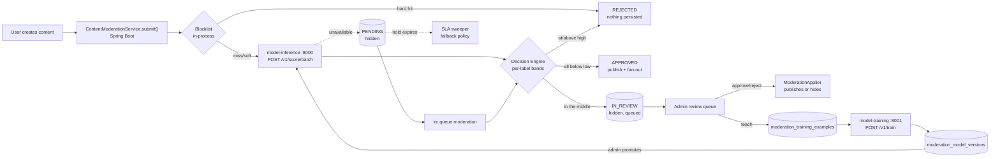

# Automated Text Moderation

Every piece of user text on this platform is scored by a fine-tuned toxicity
classifier before it becomes visible to anyone but its author. Clean content
publishes in well under a second; clearly abusive content never publishes at
all; the uncertain middle waits for a moderator.

## The documents

| Doc | What it covers | Audience |
|---|---|---|
| [MODERATION_ROADMAP.md](MODERATION_ROADMAP.md) | The design. Sections are cited throughout the code as `§n`. | Everyone |
| [architecture.md](architecture.md) | How the design is actually implemented here — packages, tables, call paths, what deviates and why. | Backend |
| [admin-guide.md](admin-guide.md) | Running the review queue, tuning thresholds, teaching the model, promoting a version. | Moderators / admins |
| [api.md](api.md) | Every admin endpoint, request/response shapes, error codes. | Frontend / integrators |
| [frontend/](frontend/README.md) | **Client & support contract** — response shapes, held-content UI states, notification copy, support answers. | Frontend / product / support |
| [user-guide/](user-guide/README.md) | **Plain-language guide** to what happens when you post, comment, message, etc. — per content type, no jargon or JSON. | End users / help-center / onboarding |
| [operations.md](operations.md) | Running the containers, health checks, failure modes, runbook. | Ops |
| [model-inference/](../model-inference/) | The scoring container. | ML / ops |
| [model-training/](../model-training/) | The fine-tuning container. | ML / ops |

## The shape of it in one picture



## Start here

**Running it locally**

```bash
docker compose up -d model-inference     # the scorer; ~2GB image, first boot pulls weights
mvn -o -Dmaven.test.skip=true spring-boot:run
```

Without `model-inference` running, content follows the configured fallback
policy per entity type — fail-closed for most things, which means posts sit
hidden waiting for a moderator. That is correct behaviour, not a bug. To develop
without the container at all:

```bash
MODERATION_ENABLED=false mvn -o -Dmaven.test.skip=true spring-boot:run
```

That disables model scoring only; the keyword blocklist still applies. It is the
local-testing escape hatch, exactly parallel to `SECURITY_PERMIT_ALL` — never set
it in production.

**Checking it works**

```bash
curl -s localhost:8000/healthz
curl -s -X POST localhost:8000/v1/score -H 'content-type: application/json' \
     -d '{"text":"you are a complete idiot"}' | jq .
```

Then, as an admin: `GET /api/v1/admin/moderation/settings` shows the effective
policy and model health in one call.

## What is deliberately not covered

Images, video frames and audio. This model only reads text — see roadmap §14 for
how a second modality would slot into the same pipeline without redesigning it.
