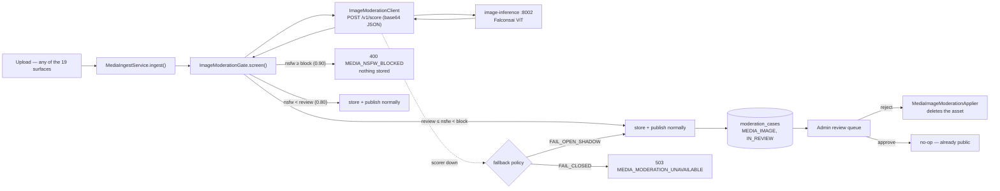

# Image moderation

Every image a user uploads — post photos, stories, avatars, covers, chat
pictures, GIFs, research figures, and the poster frame of every video — is
scored for NSFW content **before a single byte is stored**. Confidently
explicit images never enter the platform at all; the uncertain middle publishes
immediately and lands in the same admin review queue moderators already work
for text.

This is the image sibling of the [automated text moderation](README.md)
system, and it deliberately reuses that system's spine: a pure Python scorer
container with zero policy, all thresholds in `moderation_settings` so admins
retune from the dashboard without a redeploy, the same circuit-breaker client,
the same review queue, the same applier contract.

| | Text pipeline | Image gate |
|---|---|---|
| Scorer | `model-inference` :8000 (toxic-bert → xlm-roberta) | `image-inference` :8002 (Falconsai ViT) |
| Labels | 6 toxicity labels | 2: `nsfw` / `normal` (sum to 1) |
| When | quarantine-then-publish (PENDING hold) | **inline at ingest** — no hold, no worker, no sweeper |
| Bands | per-label low/high per entity type | one pair: `review` / `block` |
| Uncertain middle | held hidden, queued | **published**, queued (availability-first) |
| Review queue | shared — `/api/v1/admin/moderation/review` | same queue, entity type `MEDIA_IMAGE` |
| Retraining | yes (`model-training` :8001) | no — the checkpoint is used as-is |

## The model

[`Falconsai/nsfw_image_detection`](https://huggingface.co/Falconsai/nsfw_image_detection)
— Google's `vit-base-patch16-224` Vision Transformer fine-tuned on ~80k labeled
images into two classes. ~98% on its own eval set, ~350MB, free, and it runs
entirely on our own hardware: the checkpoint downloads from Hugging Face once
on the container's first boot, is cached in the `image-model-cache` volume, and
everything after that is fully offline. No image ever leaves the platform.

What it does: resize to 224×224 → patch embedding → transformer attention →
two softmax probabilities. What it does **not** do: describe the image, store
it, or make the final decision — the decision is the backend's thresholds.

**What it is not.** This is general NSFW classification, not CSAM detection.
CSAM detection is a separate, legally regulated category served by hash-match
systems (PhotoDNA, Thorn Safer) against NCMEC/IWF databases — required *in
addition to* this gate for any public-facing platform, not replaced by it.
Expect the usual failure modes in both directions: occasional false positives
(beach, medical, and art photography) and occasional false negatives. That is
exactly what the review band and the human queue are for.

## Architecture



The pieces, all under `ak.dev.irc.app.moderation.image` unless noted:

| Class | Role |
|---|---|
| `ImageModerationClient` | JDK-HttpClient twin of `ModerationInferenceClient`: HTTP/1.1 pinned, bounded retry, `ModerationCircuitBreaker`. One added semantic: a 4xx from the scorer throws `ImageUnscorableException` ("this file is not an image") and does **not** trip the breaker — a corrupt upload must never be mistaken for a scoring outage. |
| `ImageModerationGate` | The whole decision path. `screen()` throws for a confident block or FAIL_CLOSED outage; returns ALLOW/REVIEW otherwise. `recordReviewCase()` files review-band images into the queue. |
| `MediaImageModerationApplier` | Applies an admin's queue verdict: approve = no-op (already public); reject = delete the whole media asset (all renditions) via the async delete queue. Idempotent, as the applier contract requires. |
| `MediaIngestService` (media pkg) | The single call site. Screens image bytes at the top of `ingest()` (GIF passthrough included) and the extracted poster frame inside `ingestVideo()`. |
| `ModeratedEntityType.MEDIA_IMAGE` | The queue's entity type for these cases; `entityRef` = media asset UUID. Registered in `EnumCheckConstraintReconciler` (the enum-CHECK gotcha). |

Because everything funnels through `MediaIngestService` — multipart uploads and
chunked upload sessions alike — the gate covers all 19 upload surfaces with one
call site and zero per-surface wiring.

## The decision, precisely

With defaults `review = 0.80`, `block = 0.90` on the `nsfw` probability —
deliberately **precision-tuned**: the target is pornographic/explicit content
only. Real explicit content scores ≥0.95 on this checkpoint almost always,
while portraits, beach photos and other skin-adjacent-but-benign images must
pass without ever entering the queue:

| Outcome | Condition | What happens |
|---|---|---|
| **Allow** | `nsfw < 0.80` | Nothing. The upload proceeds exactly as before this system existed. |
| **Review** | `0.80 ≤ nsfw < 0.90` | Upload proceeds and publishes; an `IN_REVIEW` case (`MEDIA_IMAGE`, ref = assetId, one field holding the image URL) is filed for a human. No author notification unless a human rejects. |
| **Block** | `nsfw ≥ 0.90` | `400 MEDIA_NSFW_BLOCKED`. Nothing is stored — the whole multi-file request rolls back (the ingest batch contract). |
| **Unscorable** | scorer answers 4xx (corrupt bytes, bomb) | Allowed through unscored; the media pipeline's decoders reject the file with their own error. Not a breaker failure. |
| **Scorer down** | timeout / 5xx / circuit open | The `image.fallback` policy: `FAIL_OPEN_SHADOW` (default) publishes and files a review case flagged `MODEL_UNAVAILABLE` + `slaBreached`; `FAIL_CLOSED` refuses with `503 MEDIA_MODERATION_UNAVAILABLE`. |

Two deliberate policy choices that differ from text:

- **The review band publishes instead of holding.** An image the model is
  unsure about is far more often a beach photo than porn; holding every
  uncertain avatar hostage for hours would hurt more than the residual
  exposure. Rejection from the queue retracts it. (Tighten by raising
  `image.threshold.review` toward `block`, or flip philosophy entirely by
  lowering `block`.)
- **Chat images never enter the review queue.** The same policy that redacts
  `CHAT_MESSAGE` text from staff: private correspondence does not go in front
  of humans. The **block** threshold still applies to chat — confidently
  explicit DM images are refused at upload — only the uncertain-middle queue is
  skipped.

Video posters: the representative frame extracted at ingest is screened with
the same bands (`image.video-posters=false` disables). A blocked poster rejects
the whole video upload; a review-band poster files a case whose rejection
deletes the whole video asset.

## Configuration

Bootstrap defaults in `application.yaml` under `app.moderation.image.*`
(env-overridable), runtime overrides via `moderation_settings` keys — the same
two-layer scheme as everything else in this subsystem. The master
`MODERATION_ENABLED=false` escape hatch kills this gate too.

| Settings key (runtime) | Yaml bootstrap | Default | Meaning |
|---|---|---|---|
| `image.enabled` | `enabled` / `IMAGE_MODERATION_ENABLED` | `true` | The image gate switch (ANDed with the master switch) |
| `image.threshold.block` | `block-threshold` | `0.90` | At/above → upload rejected |
| `image.threshold.review` | `review-threshold` | `0.80` | At/above (below block) → publish + queue. Clamped ≤ block. |
| `image.fallback` | `fallback` | `FAIL_OPEN_SHADOW` | Scorer-down behavior (`FAIL_CLOSED` refuses uploads) |
| `image.video-posters` | `score-video-posters` | `true` | Screen extracted video poster frames |

Connection knobs (yaml only, like the text client's): `base-url`
(`IMAGE_MODERATION_URL`, default `http://localhost:8002`), `api-key`
(`IMAGE_MODERATION_API_KEY`, must equal the container's
`IMAGE_INFERENCE_API_KEY`), `timeout-ms` (4000), `max-attempts` 2, and the
circuit-breaker trio. Before any byte crosses the wire the gate **pre-scales**
the image to ≤512px JPEG (`prescale-max-dim`; 0 disables) — the model works at
224×224 internally, so a multi-megabyte original buys nothing over a ~50KB
thumbnail. Measured effect: ~1.1s → ~120ms per image end-to-end.

Runtime tuning goes through the existing settings API — no new endpoints:

```
PATCH /api/v1/admin/moderation/settings   {"image.threshold.block": "0.92"}
GET   /api/v1/admin/moderation/settings   → effective view includes an "image" block
```

**Threshold intuition.** Lower `block` = stricter (catches more, more false
positives); higher = more lenient. Widen the review band (lower
`image.threshold.review`) when you would rather have humans glance at more
borderline images; narrow it when the queue is drowning.

## Running it locally

```bash
docker compose up -d image-inference   # first boot downloads ~350MB; watch the logs
curl -s http://localhost:8002/healthz  # {"status":"ok","model_version":"Falconsai/nsfw_image_detection"}
```

Without the container running, uploads follow `image.fallback` — with the
default `FAIL_OPEN_SHADOW` everything publishes and piles into the review queue
flagged `MODEL_UNAVAILABLE`. To develop with no scoring and no queue noise at
all: `IMAGE_MODERATION_ENABLED=false` (or the global `MODERATION_ENABLED=false`).

Scorer contract, environment variables and a curl-level smoke test:
[`../model-image-inference/README.md`](../model-image-inference/README.md).

## Ops

- **Health** rides the existing model panel
  (`ModerationMetricsService.modelHealth()` → the moderation ops endpoint):
  `imageInferenceUp`, `imageModelVersion`, `imageCircuit`, `imageCalls`,
  `imageFailures`, `imageAvgLatencyMs`, `imageInferenceError`.
- **Logs** are prefixed `[MODERATION-IMG]`. Only decisions and scores are
  logged — never image bytes, never URLs at block time.
- **Privacy.** The scorer container holds images in memory only; the backend
  sends bytes and keeps scores. Review cases store the image *URL*, not a copy
  — if the asset is deleted before review, the case renders a dead link and the
  right verdict is a no-op approve.
- **Failure drill.** Kill the container → uploads keep working (fail-open),
  breaker opens after the window fills, WARN logs appear, review cases pile up
  flagged `slaBreached`. Restart → breaker closes after cool-down, scoring
  resumes. Nothing needs re-driving.

## Responsible use

- The 0.60–0.85 band **is** the human-review pairing the model card asks for —
  do not disable the queue and run block-only unless you also accept silent
  false negatives.
- Keep CSAM obligations separate (see *What it is not* above); this gate does
  not discharge them.
- The queue's teach button is a no-op for image cases by design: there is no
  image retraining loop, and a URL must never enter the *text* training set.

## Related docs

- Admin API + runbook: [`admin doc/admin/api/image-moderation.md`](../../admin%20doc/admin/api/image-moderation.md)
- Web & mobile client guide: [image-moderation-frontend.md](image-moderation-frontend.md)
- Scorer container: [`../model-image-inference/`](../model-image-inference/README.md)
- Text pipeline (the spine this reuses): [README.md](README.md), [architecture.md](architecture.md)
- Media pipeline (the call site): [`../media/pipeline.md`](../media/pipeline.md)
